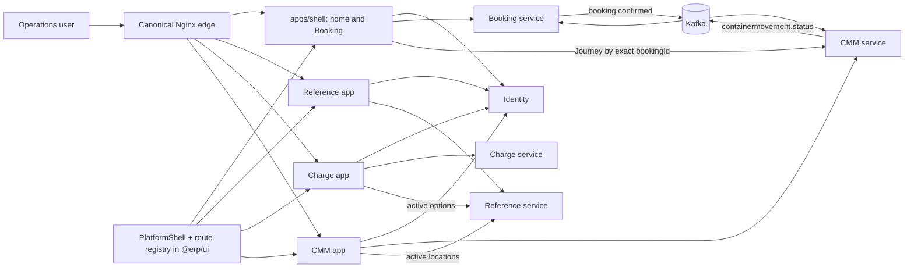

# Component Dependency - W4-01 Module List-Detail Uplift

## Sources and Dependency Rules

This model implements approved `requirements.md` and `stories.md`, preserves `architecture.md` and `component-inventory.md`, and follows `team-practices.md`. Source ownership is acyclic: presentation consumes shared platform contracts, BFFs consume public service ports, and services own their writes. The existing Booking/CMM runtime event choreography is intentionally cyclic and is documented as such.

## Dependency Matrix

| Consumer | Shared shell registry/`@erp/ui` | Identity | Own BFF/provider | Reference service | CMM service | Kafka | Owned DB |
| --- | --- | --- | --- | --- | --- | --- | --- |
| `apps/shell` home/Booking | consume | session + policy | Booking client | existing Booking dependencies | exact Journey-by-Booking lookup | - | - |
| Reference app | consume | session + policy | Reference service | own provider | - | - | - |
| Charge app | consume | session + policy | Charge service | bounded active options | - | - | - |
| CMM app | consume | session + policy | CMM service v2 | active locations | own provider | - | - |
| Reference service | - | policy port | own ports | - | - | existing | owned |
| Charge service | - | policy port | own ports | existing | - | existing | owned |
| Booking service | - | policy port | own ports | existing | - | publish/consume | owned |
| CMM service | - | assertion-to-policy | own ports | existing | - | consume/publish | owned |

`consume` means use one platform-owned implementation and registry, never copy it. The edge routes to the domain app directly; it is not a React/HTML composition layer.

## Runtime Context Diagram



Text fallback: Nginx sends each canonical prefix to its owning app. Every app renders the same shared shell implementation. Shell-owned Booking calls Booking and exact CMM lookup; each domain app calls its provider; Charge and CMM use bounded Reference lookups. Booking and CMM retain their two-way event choreography.

## Canonical Route and Asset Flow

```text
GET /container-movement/journeys/J-1
  -> Nginx preserves URI, cookie, host, forwarded scheme, server correlation
  -> apps-container-movement with basePath=/container-movement
  -> root layout validates session and renders shared PlatformShell
  -> route BFF authorizes container-movement:read
  -> internal CMM v2 GET with signed subject assertion
  -> page HTML; assets load from /container-movement/_next/*
```

Reference and Charge follow the same mechanism with their prefixes. `apps/shell` owns `/` and `/booking*`. Direct refresh is therefore a normal app request, not a proxy-side HTML include.

## Read and Mutation Flows

```text
Browser -> owning app route -> session -> Identity ALLOW -> allow-list -> provider
Provider typed result -> BFF ReadResult -> shared-shell page composition -> Browser
DENY/ERROR -> shared safe state; no provider data flash
```

```text
Browser form + opaque server-issued attempt token -> CMM BFF
CMM BFF -> session + capture ALLOW + token/input validation
CMM BFF -> signed subject assertion + trusted Idempotency-Key/correlation -> CMM v2 command
CMM transaction -> Journey + idempotency receipt + outbox
Accepted -> authoritative v2 re-read -> UI
Conflict -> current lifecycle/required next/reference + replacement token
Unknown -> re-read with original token retained; no automatic replay
```

## Booking-to-Journey Navigation

```text
apps/shell /booking/[bookingId]
  -> shell Booking relationship BFF
  -> Identity target-read authorization
  -> CMM v2 /api/container-movement/bookings/{bookingId}/journey
  -> present: /container-movement/journeys/{journeyId} + signed Booking-origin token
     absent: Journey not created
     denied: shared target denied semantics
     failure: Retry while Booking detail remains usable
```

Journey-to-Booking uses the provider's exact `bookingId` to `/booking/[bookingId]` plus a signed Journey-origin token. Each target verifies subject, source record/href, expected target, and ten-minute expiry before rendering Back; invalid tokens fall back canonically. Agreement/Booking reverse links remain blocked exactly as specified by the requirements matrix.

## CMM Timeline Dependency

```text
CMM expectedMovements + accepted history
  -> provider-owned timelineV1 normalizer
  -> versioned v2 Journey DTO
  -> CMM BFF pass-through/view translation
  -> ordered shared UI timeline
```

The BFF/browser does not merge, deduplicate, map next move, or invent missing received/source evidence. Timeline rendering does not depend on Kafka publication or Booking application.

## Source Ownership and Runtime Cycle

- Shell implementation/configuration depends on no domain frontend.
- Domain frontends consume shared presentation/auth/config packages and public services, never another app's React source.
- `apps/shell` owns the canonical Booking page; this W4 seam does not move it to `apps/booking`.
- Backend writes remain service-owned; no cross-service SQL exists.
- The Booking/CMM runtime cycle is event choreography, not a source-code or shared-data ownership cycle.

## Event Loop Controls and Failure Containment

| Leg | Verified replay/idempotency control | Poison/DLQ state | Blast radius / preserved truth |
| --- | --- | --- | --- |
| Booking outbox -> Kafka | durable claim, retryable delay, permanent failure disposition | Publisher permanent failure remains in owned outbox | Booking truth persists; Journey creation may lag |
| Kafka -> CMM | event idempotency key replay, Booking revision stale guard, audit disposition | No listener error handler/DLQ/replay contract found; BLOCKED | Poison can block one partition; other partitions and Booking reads continue |
| CMM outbox -> Kafka | durable outbox with retry/permanent dispositions | Publisher permanent failure remains in CMM outbox | Journey/capture truth persists; Booking projection may lag |
| Kafka -> Booking | durable event receipt, duplicate event-ID suppression, stale/stronger projection rules | No listener error handler/DLQ/replay contract found; BLOCKED | Poison can block one partition; CMM detail and direct relationship lookup continue |

No new topic is authorized by W4. Event-path acceptance remains blocked until service/platform owners produce verified replay/poison controls or approve a bounded change. The UI must never label persisted, published, delivered, and Booking-applied as the same outcome.

## Failure and Blast-Radius Matrix

| Failure | Affected surface | Preserved surface | Required response |
| --- | --- | --- | --- |
| Identity | requested module/action | authenticated shell-safe chrome | fail closed; no provider call |
| shared shell release missing | all canonical route integration | domain/provider contracts | BLOCKED; no local shell fork |
| Reference | Reference pages, Charge labels, CMM capture locations | authorized raw IDs and unrelated facts | scoped error; unsafe mutation disabled |
| Charge | Charge pages/Booking pricing dependency | other prefixes | typed provider state |
| CMM | CMM pages and Booking relationship lookup | Booking core detail/projection already persisted | target-scoped Retry; no guessed link |
| Booking | canonical Booking pages | CMM Journey detail | Booking-target error only |
| Kafka lag/outage | publication/application evidence | owning aggregate and synchronous reads | show separate statuses; no false downstream success |
| poison event | one consumer partition under current config | other partitions and synchronous modules | BLOCKED operational dependency; operator evidence required |
| one app/mount | that prefix | other prefixes and shared session | route-specific health/503; no global false outage |

## Verification

Architecture tests assert prefix/basePath/assets, one shared shell implementation, one landmark/navigation set, host-wide session, the exact eleven-header public-edge clear list plus five trusted replacements, exact capabilities, forbidden app imports, invalid-query/read-result mapping, safe list return and signed cross-module origin contracts, CMM media/assertion/idempotency contracts, the typed Charge-to-Reference option method/transport, Booking ownership, timeline normalization, event compatibility/idempotency, and explicit poison-control evidence. Live Compose tests exercise direct refresh, present/absent/denied/degraded links, accepted/rejected capture, and target-scoped failures.

Static dependency evidence is not runtime acceptance.
