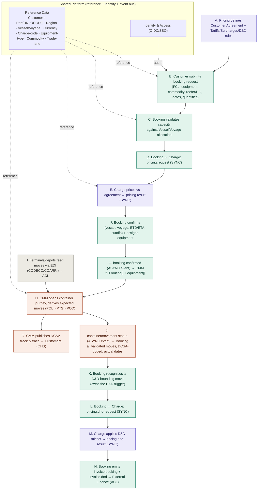
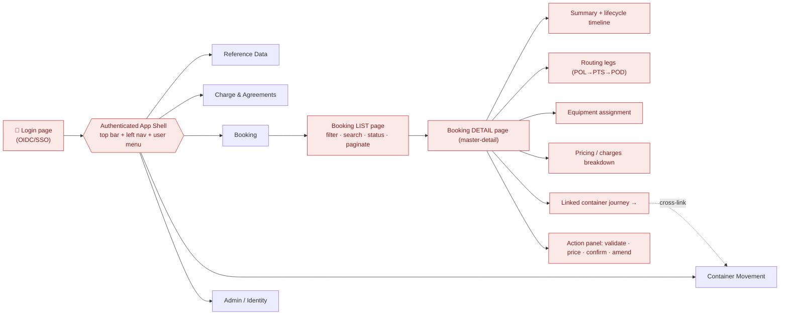
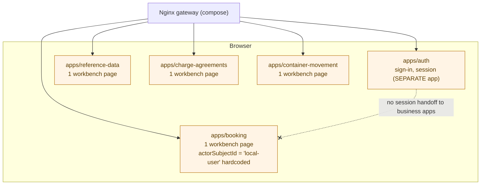
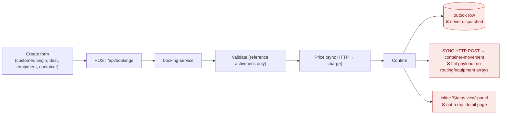

# LinerCore ERP — Workflow Map (Target A→Z vs. Current Reality)

> Built from `program-vision-document.md` §3–§5, the three `enterprise-contracts/*.md`, and a code-level verification pass (2026-07-11).
> Legend for status badges used below: ✅ implemented · 🟡 partial/degenerate · ❌ missing.
>
> **How to read this file:** Diagram 1 is the *target* business flow the docs promise. Diagram 2 is the *target* user/navigation experience you described (login → app → modules → detail). Diagrams 3–4 show what the code *actually* does today. The contrast is the gap.

---

## 1. Target business workflow — "Quote to Cash, carrier side" (Journey 1, Vision §3)

**Implementation status of each step:**

| Step | Capability | Status | Note |
|---|---|---|---|
| A | Agreement + tariffs/surcharges/D&D rules | 🟡 | Agreement lifecycle exists; **Tariff/Surcharge = 0 in code**, D&D rules minimal |
| B | Booking request (commodity, reefer/DG, quantities) | 🟡 | Only customer + flat origin/dest + single equipment string; **no commodity, reefer/DG, quantities** |
| C | Capacity validation vs Vessel/Voyage | ❌ | `validate()` only checks reference *activeness*; **no capacity, no Vessel/Voyage** |
| D–E | Sync pricing request/result | ✅ | Real sync HTTP path exists |
| F | Confirm with vessel/voyage/ETD/ETA/cutoffs + equipment | 🟡 | Confirms status only; **no voyage/ETD/ETA/cutoffs, no equipment assignment model** |
| G | `booking.confirmed` **async event** | ❌ | Delivered as **synchronous HTTP POST**; payload is flat, **no `routing[]`/`equipment[]`** (see gap analysis) |
| H | CMM journey + derive POL/PTS/POD moves | 🟡 | Journey intake exists; **no multi-leg routing derivation** |
| I | EDI ingestion (ACL) | ❌ | Not built (Phase-2 per docs — acceptable) |
| J | `containermovement.status` async, DCSA-coded | 🟡 | Callback exists as HTTP; **no DCSA move codes** |
| K–M | D&D trigger + sync D&D pricing | 🟡 | D&D scaffolding present; ruleset shallow |
| N | Invoice emission to Finance | ❌ | **`invoice` ≈ 0 in code** |
| O | DCSA track & trace OHS | ❌ | **DCSA = 0 in code** (55 doc mentions) |

---

## 2. Target user experience — the tour you described (login → app → modules → detail)

This is the navigation model that *should* exist. **None of the shell, routing, or detail layers exist today** (see Diagram 4).

> Everything in red is **not implemented**. The auth app exists as a *separate* island (Diagram 3) but is not the gateway to the business apps.

---

## 3. Current architecture reality — five disconnected islands

**Problems visible here:** no shared shell, no cross-module navigation, auth is not wired into any business app (each hardcodes a local user), each app is a single page with no list/detail routing.

---

## 4. Current booking "workflow" as actually coded

---

## Cross-references

- Backend integrity findings (event facade, dual-write, dead outbox, contract-theater): [`codex-review-findings.md`](codex-review-findings.md)
- Business-logic, field-naming, DCSA, and UI/UX gaps with fixes: [`erp-business-ui-gap-analysis.md`](erp-business-ui-gap-analysis.md)
