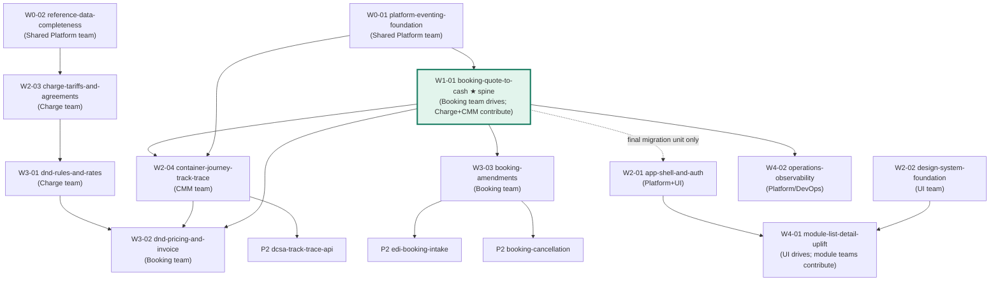

# LinerCore Program Intent Backlog — the single queue

> This is the **one program-level backlog of vertical intents**. There are no per-module intent backlogs — modules own *knowledge and code*, the program owns *delivery*. Built from `program-vision-document.md` §3–§5, the enterprise contracts, and the gap analyses. Method: [`aidlc-v2-slicing-playbook.md`](../aidlc-v2-slicing-playbook.md).

## How to run an intent (any AI: Claude, Codex, Kiro)

1. **Pick the next unblocked intent** from the DAG below (all its incoming edges closed).
2. **Open a fresh session** and give the AI the intent's statement file (`docs/intents/<file>.md`) as the freeform intent input to AI-DLC — or paste it at intent-capture. The statement's **Context Pack** section lists exactly which docs the session must read first; the AI-DLC engine also auto-loads the knowledge base (`aidlc/spaces/default/knowledge/`, `codekb/`) per stage-protocol §5, and the binding templates in `aidlc/spaces/default/memory/templates/` shape every artifact it writes.
3. Work happens on an **intent branch** (`intent/<slug>`), one Driver team per intent (see Ownership below).
4. **Exit gate:** DoD observed on the live Compose stack + `aidlc-audit` + `erp-fidelity-audit` green + quality gates green → merge to main → mark the intent closed here.

Repo-level wiring: `AGENTS.md` (Codex), `CLAUDE.md` (Claude Code), or Kiro steering files must point here — done for `AGENTS.md`.

## Program DAG

**Parallel lanes by wave** (intents in the same wave with no edge between them can run simultaneously in separate team sessions):

| Wave | Parallel intents | Teams busy |
|---|---|---|
| 0 | W0-01 ∥ W0-02 ∥ W2-02 (no deps) | Platform ×2, UI |
| 1 | W1-01 ★ ∥ W2-01 (all units except the final booking-migration unit) | Booking(+Charge,CMM), Platform+UI |
| 2 | W2-03 ∥ W2-04 ∥ (W2-01 finishes) | Charge, CMM, UI |
| 3 | W3-01 → W3-02 ∥ W3-03 ∥ W4-01 | Charge→Booking, Booking, UI |
| 4 | W4-02 ∥ Phase-2 starts | Platform |

## Ownership model — Driver & Contributors

Every intent has **exactly one Driver team** — accountable end-to-end, runs the AI-DLC session, owns the branch and the merge. When an intent crosses module boundaries (most vertical intents do), the other module teams are **Contributors**, and the interface between Driver and Contributor is **always the contract** (`contracts/`), never shared code editing:

- **Provider side of a seam** → implemented by the *owning module's* team (as a unit inside the intent that the Contributor executes, or as a reviewed PR into their module).
- **Consumer side** → the Driver builds against the **frozen contract** with a consumer-driven test (Pact), and integrates live when the provider lands.
- Code ownership is enforced with `CODEOWNERS` per `services/<x>` / `apps/<x>`; a Driver never merges changes to a foreign module without the owning team's review.
- `contracts/` is the shared kernel: **append-only, dual sign-off** (producer + consumer teams) on any change.

Example: **W1-01** is driven by Booking. Charge contributes the live pricing endpoint (their module, their review); CMM contributes the `booking.confirmed` consumer; Platform contributes broker/SR wiring from W0-01. One intent, one Driver, three Contributors, zero shared-file editing.

## Cross-intent dependencies — the protocol

Your scenario — *"intent 3 of module A depends on intent 10 of module B"* — mostly **dissolves** once backlogs are program-level and vertical: dependencies become explicit edges in ONE DAG, sequenced before work starts. For the residual real cases:

1. **A dependency may only target a *closed* intent.** If A needs something from an in-flight/unstarted B, do one of:
   - **Resequence** — move B (or the needed part) earlier in the wave plan.
   - **Split a precursor** — extract just the needed piece of B into a small intent that closes first (that's exactly what W0-01/W0-02 are).
   - **Contract-first bridge** — freeze the contract *now* (both teams sign), A builds against the frozen contract + Pact stub, B implements the provider later; integration verified when B closes. A's intent stays open (not "done") until the live integration is observed.
2. **Never build against an unfrozen contract.** That is how silent drift (the `equipmentTypeId`/`equipmentTypeCode` split) happened.
3. New dependency discovered mid-intent → add the edge here, notify the other Driver, choose 1a/1b/1c. The backlog file is the coordination point.

## Parallelism — the two swarm layers

- **Inside an intent (native AI-DLC swarm):** the units DAG in `unit-of-work-dependency.md` (the fenced `yaml units:` block) is machine-read by the engine and compiled into **batch fan-out** — units without an edge between them run in parallel within the session. This is where fine-grained parallelism belongs.
- **Across intents (team-level swarm):** separate teams run separate sessions on separate intent branches — safe when the intents (a) share no DAG edge and (b) touch disjoint code hotspots (module ownership makes this mostly automatic). Merge in DAG order, each merge gated by quality gates + the two audits. Prefer short-lived branches and frequent rebase on main; the walking-skeleton/contract layers land early precisely so parallel work has stable ground.

## The intents

| Id | Intent | Driver | Depends on | Statement |
|---|---|---|---|---|
| W0-01 | Platform eventing foundation — real Kafka/SR publisher, shared outbox relay + scheduler, kill placeholders (fixes C1–C5) | Shared Platform | — | [W0-01](W0-01-platform-eventing-foundation.md) — **Closed 2026-07-13** ([evidence](../../artifacts/w0-01-live/README.md)) |
| W0-02 | Reference-data completeness — Vessel/Voyage, Equipment-type, Charge-code modeled + seeded + APIs | Shared Platform | — | [W0-02](W0-02-reference-data-completeness.md) — **Closed 2026-07-14** ([evidence](../../artifacts/w0-02-live/live-proof-summary.json)) |
| W1-01 ★ | Booking quote-to-cash spine — create→validate→price→confirm→real event→journey→status back→detail page | Booking | W0-01 | [worked example](../examples/booking-quote-to-cash/intent-statement.md) *(questions answered)* — **Closed 2026-07-20** ([real live evidence](../../artifacts/w1-01-live/w1-real-pass-20260720-verified/manifest.json)) |
| W2-01 | App shell & auth — one shell, login gates it, session to all modules, kill `local-user` | Platform+UI | soft: W1-01 (migration unit) | [W2-01](W2-01-app-shell-and-auth.md) — **Closed 2026-07-19** ([evidence](../../artifacts/w2-01-live/app-shell-auth/manifest.json)) |
| W2-02 | Design-system foundation — @erp/ui tokens + primitives; Booking migrated as reference | UI | — | [W2-02](W2-02-design-system-foundation.md) — **Acceptance pending** ([preflight gap](../../artifacts/phase1-preflight-20260721/w2-02-closure-gap.md)) |
| W2-03 | Charge tariffs & agreements — tariff/surcharge/local-charge model, agreement versioning, real quote math | Charge | W0-02 | [W2-03](W2-03-charge-tariffs-and-agreements.md) |
| W2-04 | Container journey & track-trace — DCSA T&T event model, journey detail, movement capture | CMM | W1-01, W0-01 | [W2-04](W2-04-container-journey-track-trace.md) |
| W3-01 | D&D rules & rates — rule types (move-pair bounded), free time, daily rates | Charge | W2-03 | [W3-01](W3-01-dnd-rules-and-rates.md) |
| W3-02 | D&D pricing & invoice — Booking trigger → sync D&D pricing → invoice emission to Finance | Booking | W3-01, W2-04, W1-01 | [W3-02](W3-02-dnd-pricing-and-invoice.md) |
| W3-03 | Booking amendments — amend/reconfirm, `bookingRevision` re-emission, CMM upsert reconcile | Booking | W1-01 | [W3-03](W3-03-booking-amendments.md) |
| W4-01 | Module list-detail uplift — reference-data, charge, CMM apps to shell + list/detail pattern | UI | W2-01, W2-02 | [W4-01](W4-01-module-list-detail-uplift.md) |
| W4-02 | Operations & observability — tracing, dashboards, alerts, runbooks for the live stack | Platform | W1-01 | [W4-02](W4-02-operations-observability.md) |
**Phase 2 — Electronic connectivity, standards publication & lifecycle completion** *(answers in these statements are provisional — reconfirm when Phase 2 starts):*

| Id | Intent | Driver | Depends on | Statement |
|---|---|---|---|---|
| P2-01 | EDI / INTTRA booking intake (IFTMBF, ACL) | Booking | W1-01, W3-03 | [P2-01](P2-01-edi-booking-intake.md) |
| P2-02 | DCSA Track & Trace public API (OHS) | CMM | W2-04 | [P2-02](P2-02-dcsa-track-trace-api.md) |
| P2-03 | Booking cancellation & journey close (`booking.cancelled`) | Booking | W1-01, W3-03, W2-04 | [P2-03](P2-03-booking-cancellation.md) |
| P2-04 | Multi-leg / transshipment routing (POL→PTS→POD) | Booking (+CMM,Charge) | W1-01, W2-04, W2-03 | [P2-04](P2-04-multi-leg-transshipment-routing.md) |
| P2-05 | Operational movement ingestion EDI (CODECO/COARRI, ACL) | CMM | W2-04 | [P2-05](P2-05-edi-movement-ingestion.md) |
| P2-06 | Reefer & DG booking parameters | Booking (+Charge,CMM) | W1-01, W2-03 | [P2-06](P2-06-reefer-dg-parameters.md) |

**Phase 3 — Multi-company operation & documentation** *(further out; answers provisional, security review required on P3-01):*

| Id | Intent | Driver | Depends on | Statement |
|---|---|---|---|---|
| P3-01 | Multi-entity / multi-company operation | Shared Platform (all contribute) | Phase 1 + W2-01 | [P3-01](P3-01-multi-entity-operation.md) |
| P3-02 | Multi-currency depth (FX in pricing + invoicing) | Charge (+Booking) | W2-03, W3-02, W0-02 | [P3-02](P3-02-multi-currency-depth.md) |
| P3-03 | Additional equipment types & full reefer depth | Reference Data (+Booking,CMM) | W0-02, P2-06 | [P3-03](P3-03-additional-equipment-types.md) |
| P3-04 | Documentation / Bill of Lading (DCSA eBL) — **new module** | Documentation (new team) | W1-01, P2-04, W2-04 | [P3-04](P3-04-bill-of-lading-ebl.md) |

**Phase 3+ directional candidates** (not yet full statements — the vision names them as optional; write statements when committed): customer self-service portal; ETA prediction. These are genuinely under-specified in the current docs, so a full vertical-slice statement would be fabrication until the business defines them.

## Phase 2 & 3 wave/parallel plan

Phase 2 intents are largely independent (they hang off already-closed Phase-1 intents), so most can run in parallel across teams:

| Wave | Parallel intents | Note |
|---|---|---|
| P2-a | P2-01 ∥ P2-02 ∥ P2-03 ∥ P2-05 ∥ P2-06 | all depend only on closed Phase-1 work; disjoint hotspots |
| P2-b | P2-04 (multi-leg) | touches Booking+CMM+Charge broadly — run when those teams have capacity; not blocked, but high-coordination |
| P3-a | **P3-01 first** (multi-entity) | cross-cutting + security-sensitive; later Phase-3 intents assume entity scope |
| P3-b | P3-02 ∥ P3-03 | independent, after their Phase-1/2 deps |
| P3-c | P3-04 (eBL, new module) | new team/context; consumes booking+shipment via contracts |

Same rules as Phase 1: one Driver per intent, Contributors via frozen contracts + CODEOWNERS, dependency-order merge behind quality gates + both audits, and **every intent exits on an observed live run.**

**Status tracking:** when an intent closes, mark it here with the closing date and the evidence path. Do not start an intent whose dependencies aren't closed (except contract-first bridges, marked as such).

## Test acceptance waivers

- 2026-07-17 (historical): W1-01 was merged to `integ/main-reconciled` under explicit test-project authority. The original live-acceptance manifest `artifacts/w1-01-live/w1-merge-gate-20260716-200141/manifest.json` remains `BLOCKED` at `compose-start` and has not been rewritten as a PASS. Waiver evidence remains at `artifacts/w1-01-live/w1-test-acceptance-waiver-20260717/acceptance-waiver.md`. Official Elasticsearch and Kibana images subsequently became available locally, and the clean full-profile build/reproducibility blocker was resolved. Current real acceptance is the separate `PASSED` manifest at `artifacts/w1-01-live/w1-real-pass-20260720-verified/manifest.json`.
