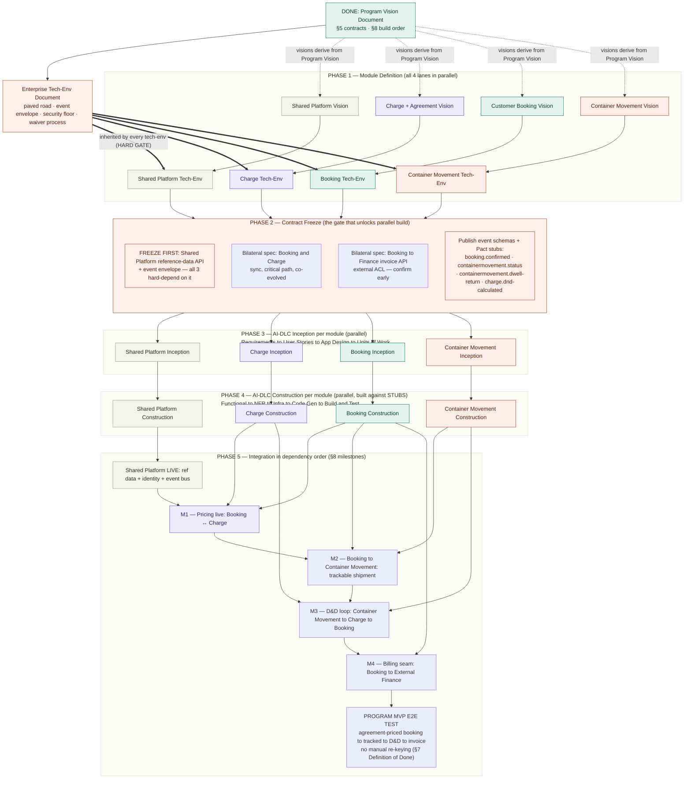

# Program Execution Plan — LinerCore

> **Program:** LinerCore — commercial and equipment-lifecycle platform for container liner / feeder carriers.
> **Document type:** Program Execution Plan (sequencing, overlap, and integration plan for the AI-DLC runs).
> **Companion documents:** [Program Vision Document](./program-vision-document.md) (§5 contracts, §8 build order), the Enterprise Technical Environment Document (forthcoming), and the per-module Vision / Tech-Env documents.
> **Methodology:** AI-DLC (`awslabs/aidlc-workflows`). AI-DLC runs **per module** — Inception (Requirements → User Stories → Application Design → Units of Work) then Construction (Functional Design → NFR Requirements → NFR Design → Infrastructure Design → Code Generation → Build & Test). This plan orchestrates those per-module runs.

---

## The core idea

The §8 build order (Shared Platform → Charge → Booking → Container Movement) is a **dependency order, not a calendar order.** Because the modules are decoupled behind contracts, they do not have to be built one after another. The move that converts that serial chain into parallel work is a **contract-freeze gate**: once each seam's interface (event schema / API spec) is published and frozen, every module team builds against *stubs* of its dependencies, and Pact contract tests guarantee the stub matches the real thing. The dependency order then only governs **integration milestones (M1–M4)** — when real modules actually meet — not when construction can *start*.

The program therefore runs in three bands:

- **Serial foundation** — must happen in order, once, for the whole platform.
- **Parallel per-module work** — visions, tech-envs, inceptions, constructions, all four lanes at once.
- **Dependency-ordered integration** — modules join up in §8 order at fixed checkpoints.

---

## What is genuinely serial (the hard gates)

The only true gates are:

1. Program Vision → **Enterprise Tech-Env** (everything inherits it).
2. Enterprise Tech-Env → every **Module Tech-Env** (the conformance addendum literally cites its version).
3. **Contract Freeze → real integration** (you cannot integration-test an unfrozen contract).
4. **Shared Platform delivered → real (not stubbed) integration** for the other three, since they hard-depend on its reference data, identity, and event bus.
5. **Dependency order for integration milestones**: Platform → (Charge, Booking) → Container Movement, closing M1 → M2 → M3 → M4.

Everything else overlaps.

---

## On bilateral contract documents — mostly *no*

Separate bilateral contract documents are largely unnecessary. The Program Vision §5 already *names* every seam (the `Contract Name` column: `pricing.request`, `booking.confirmed`, `charge.dnd-calculated`, etc.), and the Enterprise Tech-Env defines the *envelope and format* once. For internal published-language events the authoritative contract is simply the **producing module's AsyncAPI/event schema in the registry + its Pact stub** — no prose document needed (a separate document would violate AI-DLC's *no-duplication* tenet).

Write a short bilateral interface spec for only **two** seams, both because they are high-risk, not because the pattern demands it:

- **Booking ↔ Charge** — synchronous, on the critical path, and a tightly co-evolved Customer/Supplier pair (the Context Map flags exactly this). These two cannot be cleanly decoupled by a frozen contract alone; spec them together and build them in close coordination.
- **Booking → External Finance invoice API** — external, an Anti-Corruption Layer, and already a named risk (§10). Confirm and contract-test it early (milestone M4).

By contrast, **Container Movement Management** is the cleanest lane: it talks only in published-language events and offers a DCSA Open Host Service, so it is the most independently buildable of the three.

---

## Execution flowchart

Module lanes are color-coded (Charge purple, Booking green, Container Movement orange, Shared Platform neutral) to match the Context Map in the Program Vision.

---

## Gates vs. overlap, at a glance

| Step | Serialize or overlap | Why |
|------|---------------------|-----|
| Enterprise Tech-Env | **Serial after Program Vision** | Every module tech-env inherits its version |
| 4 × Module Vision | **Parallel** (can start immediately, alongside Enterprise Tech-Env authoring) | All derive from the finished Program Vision |
| 4 × Module Tech-Env | **Parallel, but gated on Enterprise Tech-Env** | Conformance addendum cites the enterprise version |
| Contract freeze | **Serial gate** (Shared Platform contracts first) | Unlocks stub-based parallel construction |
| 4 × Inception | **Parallel** | Each consumes docs + frozen contracts, never another module's code |
| 4 × Construction | **Parallel against stubs** | Pact tests guarantee stubs match real implementations |
| Integration (M0 → M4 → E2E) | **Dependency order (§8)** | Real modules can only meet once both exist |

---

## Critical path and where to push

The longest real chain is **Enterprise Tech-Env → Shared Platform contracts frozen → Shared Platform live (M0) → Booking ↔ Charge (M1) → Booking → Container Movement (M2) → D&D loop (M3) → billing (M4)**. Three levers shorten it:

1. Freeze the Shared Platform reference-data and event-envelope contracts *first*, so the other three can stub immediately.
2. Treat Booking and Charge as one coordinated effort rather than two handoffs.
3. Confirm the external Finance invoice contract at the very start — it is the highest-uncertainty external seam and the last integration milestone.

Container Movement, being events-only, can run as the most independent lane and simply join at M2 / M3.

---

## Definitions referenced above

**Stub** — a stand-in implementation of a dependency that returns canned, pre-programmed responses so the code under development can run before the real dependency exists. It contains no real logic. Example: while Charge is still being built, Booking runs a stub of Charge that returns a fixed `pricing.result` for any `pricing.request`, letting Booking be built and tested as if Charge were live.

**Pact / Pact stub** — Pact is a consumer-driven contract-testing tool. The consumer (e.g. Booking) writes a test stating the interactions it depends on; running it spins up a **Pact stub** (a local mock server generated from those expectations) and emits a **pact file** (JSON recording every expected request/response pair — *this is the contract*). The provider (e.g. Charge) then replays that pact file against the real service and asserts the responses match, failing in its own pipeline if it would break the contract. Because the consumer's stub and the provider's verification derive from the same contract, "green against the stub" reliably implies "works against the real thing" — which is what makes the parallel construction in Phases 3–4 safe. For asynchronous event seams (`booking.confirmed`, `containermovement.dwell-return`, `charge.dnd-calculated`), the equivalent is **message-based contract testing** (Pact's message-pact variant), where the contract is over the message payload rather than an HTTP exchange.
