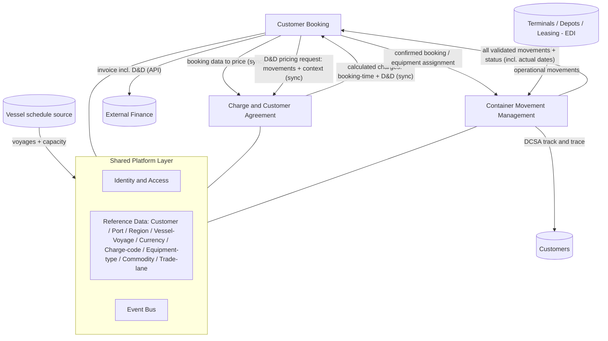
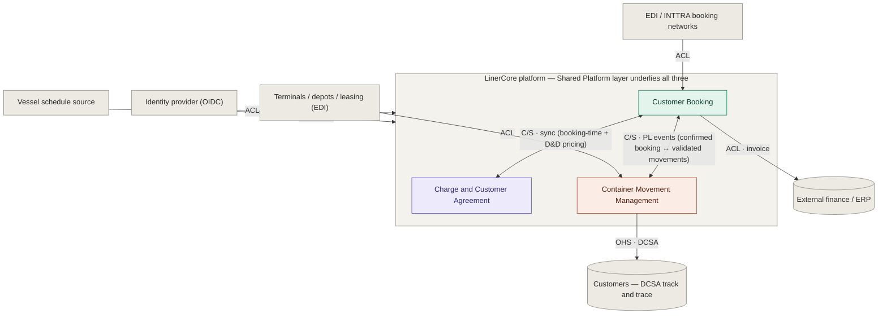

# Program Vision Document — Liner Carrier Commercial & Equipment Platform

> **Program:** *(working title)* **LinerCore** — a commercial and equipment-lifecycle platform for container liner / feeder carriers.
> **Document type:** Program Vision Document (enterprise / multi-module).
> **Context:** Greenfield. Carrier perspective (operates its own vessels and sells space to its customers).
> **Status:** Draft v0.3 for review (D&D flow redesigned; Shared-Platform reference scope expanded; MVP equipment & D&D-rule scope widened — see §10 Resolved Decisions).
> **Companion guides:** Module Vision Documents are derived from this document; technical standards are defined in the (forthcoming) Enterprise Technical Environment Document.

---

## 1. Executive Summary

LinerCore is an integrated commercial-and-equipment platform that enables container **liner and feeder carriers** to price customer agreements, accept and confirm space bookings on their own vessels, and track every container across its full lifecycle on a single shared data foundation. It replaces the fragmented spreadsheets, point tools, and manual re-keying that today separate a carrier's pricing desk, booking desk, and equipment-control function — and that cause revenue leakage where charges such as detention and demurrage go unbilled. The platform is delivered as three interconnected business modules — **Charge Calculation & Customer Agreement**, **Customer Booking**, and **Container Movement Management** — sitting on a thin **Shared Platform layer** that owns common reference data and integration plumbing. The expected outcome is a single source of truth for every customer agreement, booking, and container, with charges (including movement-driven detention & demurrage) calculated automatically and emitted as invoices to the carrier's external finance system without manual re-entry.

---

## 2. Business Context

### Problem Statement

A container carrier's commercial and equipment functions are tightly coupled in reality but are usually run on disconnected tools. Pricing is maintained in spreadsheets; bookings are taken in a separate operations system or by email; container status lives in yet another tool or in carriers' inboxes. Because these are not connected:

- Bookings are priced from rates that are out of date or manually transcribed, producing quoting errors and disputes.
- Detention & demurrage — charges driven entirely by *when a container moves and is returned* — are calculated late, inconsistently, or not at all, because the movement data and the charge rules live in different systems. This is a well-known and material source of carrier revenue leakage.
- Customers and internal staff cannot see a single, reliable container status, so service teams answer "where is my box?" by hand.
- The same entities (a customer, a port, a vessel/voyage, a container) are re-keyed across tools, and the versions disagree.

The problem this platform solves exists **at the seams between pricing, booking, and equipment** — not inside any one of them.

### Business Drivers

- **Revenue protection.** Automating movement-driven detention & demurrage closes a recognised leakage point: charges that are legitimately owed but lost to administrative delay.
- **Greenfield opportunity.** No legacy system constrains the design; the carrier can adopt modern industry standards (DCSA, UN/EDIFACT) from day one rather than retrofitting them.
- **Customer experience.** Shippers increasingly expect carrier-grade, standards-based track & trace and fast, accurate booking confirmations.
- **Operational cost.** Eliminating cross-tool re-keying frees pricing, booking, and equipment-control staff for exception handling rather than data entry.

### Target Users and Stakeholders (Enterprise)

The platform is operated **by the carrier**, serving the carrier's own staff and, through them, the carrier's customers.

| User Type | Function / Module Affinity | Description | Primary Need |
|-----------|----------------------------|-------------|--------------|
| Pricing / Trade manager | Charge & Customer Agreement | Maintains tariffs, surcharges, D&D rules; negotiates customer agreements | Define and version rates and agreements that bookings price against automatically |
| Sales / Account manager | Charge & Customer Agreement | Owns customer relationships and commitments | Issue accurate quotations and agreements quickly |
| Booking desk / Customer service | Customer Booking | Receives and confirms booking requests | Validate space, price, and confirm bookings with no re-keying |
| Equipment control | Container Movement Management | Manages the container fleet and its status | A single, current view of every container's lifecycle state and location |
| Customer (shipper / BCO) | Booking + Container Movement | The carrier's customer | Book space, receive confirmations, and self-serve track & trace |
| Finance (external system owner) | Cross-module (downstream) | Consumes invoices from the platform | Receive complete, correct invoices via API |
| Commercial / Operations executive | All | Owns platform outcomes | Reliable revenue capture and operational visibility |

### Enterprise Business Constraints

- **Finance is external.** This platform calculates charges and emits invoices; it does **not** own the general ledger, accounts receivable, or collections. The boundary is a finance API.
- **Out of scope by design:** freight-forwarder business (multi-carrier rate shopping, forwarder CRM, consolidation-broker workflows, customs brokerage); depot stock / container inventory management; maintenance & repair (M&R) operational workflows; detailed vessel scheduling and stowage planning.
- **Standards alignment.** Where an open industry standard exists (DCSA Track & Trace for container movements; UN/EDIFACT for operational messaging), the platform should conform rather than invent.
- **Auditability.** Because the platform's outputs are money (charges) and dispute evidence (container movements), every charge calculation and every recorded movement must be traceable.

### Enterprise Success Metrics

Baselines are marked TBD because this is a greenfield build; they are to be measured at first production deployment.

| Metric | Current State | Target State | Measurement Method | Owning Stakeholder |
|--------|---------------|--------------|--------------------|--------------------|
| Manual re-keying across pricing → booking → billing (standard FCL) | TBD (manual today) | Zero re-keying | Process audit of standard bookings | Commercial executive |
| Detention & demurrage capture rate (eligible D&D actually invoiced) | TBD | ≥ 95% of eligible | D&D invoiced ÷ D&D eligible from movements | Pricing / Trade manager |
| Booking confirmation turnaround | TBD | < target SLA (to be set) | Time from request to confirmation | Booking desk lead |
| Container movement coverage (lifecycle movements captured automatically) | TBD | ≥ 90% of expected milestones | Movements captured ÷ expected per booking | Equipment control |
| Charge dispute rate | TBD | Reduce vs baseline | Disputed invoices ÷ total invoices | Sales / Finance |

---

## 3. Full Scope Vision (Enterprise)

### Platform Vision Statement

When fully realised, LinerCore is the carrier's single commercial-and-equipment backbone: a customer agreement is defined once and every booking prices itself against it; a booking is confirmed against real vessel capacity and flows automatically into container tracking; every container's whole life — from empty-available through carriage to return, including condition and lease changes — is one continuous movement record that both informs the customer and drives the charges the carrier is owed.

### Capability Map

A capability is something the business can *do*, independent of which module implements it. This map is the raw material for the module decomposition in Section 4.

| Capability Domain | Capabilities (at full maturity) | Primary Beneficiary |
|-------------------|---------------------------------|---------------------|
| Pricing & Agreements | Maintain base tariffs (ocean freight), surcharges (BAF/CAF, GRI/PSS, and commodity-/handling-conditional surcharges such as DG and reefer), and port-specific local charges (THC, documentation, ISPS) as distinct categories; define detention & demurrage rules as data-driven rule types (a start/end movement-event pair) with free time + daily rate by port/trade; create and version customer agreements and quotations with validity and commitment; calculate booking charges on demand; calculate movement-driven D&D charges on a synchronous request from Booking; apply currency and exchange | Pricing, Sales, Customers |
| Booking & Space | Capture booking requests (FCL, equipment type, commodity code, reefer/DG indicators; detailed reefer parameters at maturity); validate against vessel/voyage capacity and allocation; confirm bookings (vessel, voyage, ETD/ETA, cargo cutoff, documentation deadlines); assign equipment; handle amendments, rolls, splits, cancellations; own the D&D trigger (recognise a D&D-bounding movement and request D&D pricing from Charge); emit invoices to finance | Booking desk, Customers |
| Container Lifecycle & Movements | Maintain the container/equipment registry (owned and leased units); record journey movements (gate in/out, load, discharge, transshipment, pickup/return); manage lifecycle state (Available, Allocated, Gated-out, In-transit, Discharged, Returned-empty, Damaged, Repaired, On-hire, Off-hire, Leased-out, Repositioning); publish customer-facing track & trace; report all validated movements (with actual dates) to Booking (it holds no D&D ruleset and does not flag which moves are D&D-relevant) | Equipment control, Customers |
| Shared Reference & Identity | Own customer/party, port/location, region, vessel/voyage schedule, currency/exchange, charge-code, equipment-type, commodity and trade-lane reference data; authenticate and authorise users; carry events between modules | All modules |

### Enterprise Integration Landscape

| External System / Service | Purpose | Modules That Use It |
|---------------------------|---------|---------------------|
| External Finance / ERP | Receives invoices (AR, GL, collections owned outside the platform) | Booking (all invoices, including D&D) |
| Vessel schedule source | Supplies sailings/voyages and capacity (detailed scheduling/stowage out of scope) | Shared Platform → Booking |
| Terminals & depots (EDI: CODECO, COARRI, etc.) | Source of operational container movements | Container Movement Management |
| EDI / e-commerce booking networks (e.g. UN/EDIFACT IFTMBF, INTTRA) | Electronic booking intake and status messaging | Booking |
| DCSA Track & Trace consumers (customers, BCOs, visibility providers) | Standards-based movement distribution and subscription | Container Movement Management |
| Container leasing partners | Source of on-hire / off-hire / lease movements | Container Movement Management |
| Identity provider (enterprise SSO/OIDC) | Authentication | Shared Platform |

### Cross-Functional User Journeys (Full Vision)

These journeys deliberately cross module boundaries — they are the reason to build one platform rather than three tools.

#### Journey 1: Agreement → Booking → Carriage → Charge ("quote to cash, carrier side")
1. Pricing defines a customer agreement and tariffs — *Charge & Customer Agreement*.
2. A customer submits a booking request — *Booking*.
3. Booking validates capacity and asks Charge to price it against the agreement; the quote returns instantly — *Booking ↔ Charge*.
4. Booking confirms (vessel, voyage, ETD/ETA, cutoffs) and assigns equipment — *Booking*.
5. The confirmed booking creates a trackable shipment and equipment assignment — *Booking → Container Movement*.
6. Container journey movements are recorded, exposed to the customer, and reported (with actual dates) to Booking — *Container Movement → Booking*.
7. When a D&D-bounding movement (e.g. gate-out, empty return) is reported, Booking makes a synchronous D&D pricing request to Charge, which applies its D&D ruleset and returns the charge — *Booking ↔ Charge*.
8. Both booking-time charges and the movement-driven D&D charge are held by Booking, which emits them as invoices to the external finance system — *Charge → Booking → Finance*.

**Modules involved:** all three + Shared Platform.
**Outcome:** a booking is priced, carried, and fully billed — including movement-driven D&D — with no manual re-keying.

#### Journey 2: Empty equipment back into circulation
1. A container is returned empty after a shipment — *Container Movement* records `Returned-empty`.
2. A condition inspection records `Damaged`, then later `Repaired` (states only; M&R workflow is external) — *Container Movement*.
3. The unit returns to `Available` and can be allocated to a new booking — *Container Movement → Booking*.
**Modules involved:** Container Movement, Booking.
**Outcome:** equipment lifecycle is a continuous record that feeds availability for the next booking.

#### Journey 3: Leased equipment lifecycle
1. A leased container is taken on-hire — *Container Movement* records `On-hire` / `Leased-out` as applicable.
2. The unit moves through normal journey and condition movements during the lease — *Container Movement*.
3. The unit is taken off-hire — *Container Movement* records `Off-hire`.
**Modules involved:** Container Movement.
**Outcome:** lease movements are part of the same lifecycle record (leasing *administration* itself remains external).

### Scalability and Growth

The platform grows along several axes: more trade lanes and regions; more equipment types (dry, reefer, special); higher booking and movement volumes; additional carrier legal entities/agencies (multi-company); and richer electronic connectivity (more EDI partners, full DCSA API publication). New capabilities — e.g. documentation/Bill of Lading, ETA prediction, or a customer self-service portal — are added as new modules or module extensions without disturbing the established seams.

### Long-Term Roadmap (Optional)

Directional only; phrased in terms of modules going live and the cross-module capability they unlock.

| Phase | Modules Delivered | Cross-Module Capability Unlocked | Timeframe |
|-------|-------------------|----------------------------------|-----------|
| MVP | Shared Platform (reduced) + Charge (reduced) + Booking (reduced) + Container Movement (reduced) | One trade lane, FCL dry plus simplified reefer/DG-indicator bookings: agreement-priced booking → tracked container → movement-driven D&D (three rule types) → invoice to finance | TBD |
| Phase 2 | Electronic connectivity (EDI/INTTRA intake; DCSA T&T publication) | Automated booking intake and standards-based customer track & trace | TBD |
| Phase 3 | Multi-entity, multi-currency depth, additional equipment types; candidate Documentation/B/L module | Multi-company carrier operation and end-to-end document flow | TBD |

---

## 4. Module Decomposition

### Decomposition Principles

- **Decompose by business capability / bounded context**, not by org chart or technology layer.
- **A module owns its data and exposes it only via contracts** — no shared databases between modules.
- **Exactly one owning module per canonical entity.** Shared reference data lives in the Shared Platform layer.
- **The three named modules are the business core;** the Shared Platform layer is foundational plumbing they all inherit (it is not a "fourth business module").
- **Keep excluded scope out:** no freight-forwarder features, no depot stock/inventory management, no M&R workflows, no detailed vessel scheduling/stowage. Condition and lease *movements* are recorded; the operational systems behind them are not built here.

### Module Catalog

| Module | Type | Purpose (one line) | Owned Capabilities | Owns Which Master Data |
|--------|------|--------------------|--------------------|------------------------|
| Charge Calculation & Customer Agreement | Business | Price agreements and calculate all charges (booking-time and movement-driven) | Tariffs, surcharges, local charges, D&D rule types + rates, agreements, quotations, charge calculation | Tariff, Surcharge definition, Local charge, Customer Agreement, Quotation, D&D rule type + D&D rate |
| Customer Booking | Business | Capture, price, validate, and confirm space bookings on the carrier's vessels | Booking lifecycle, capacity consumption, amendments/rolls/splits, invoice emission | Booking |
| Container Movement Management | Business | Track every container across its full lifecycle as movements | Container registry, journey/condition/lease movements, lifecycle state, track & trace | Container (equipment unit), Container Movement, Lifecycle state |
| Shared Platform | Shared-Platform | Common reference data, identity, and inter-module event transport | Identity/access, event bus, reference data services | Customer/Party, Port/Location, Region, Vessel/Voyage, Currency/Exchange, Charge-code, Equipment-type, Commodity, Trade-lane |

### Module Profiles

#### Module: Charge Calculation & Customer Agreement
- **Purpose:** The carrier's single charge-calculation and agreement authority.
- **Owned Capabilities:** maintain tariffs, surcharges, and port-specific local charges (as distinct categories); define D&D rule types (a start/end movement-event pair) and D&D rates (free time + daily rates by port/trade); create and version customer agreements and quotations; calculate booking charges on request; calculate movement-driven D&D charges on a synchronous request from Booking; apply currency/exchange.
- **Owns (canonical data):** Tariff, Surcharge definition, Local charge, Customer Agreement, Quotation, D&D rule type + D&D rate (the authoritative D&D ruleset).
- **Consumes from other modules:** booking data and D&D pricing requests carrying recorded movement events (both from Booking); Customer, Port, Vessel/Voyage, Currency, Charge-codes, Commodity, Trade-lane (from Shared Platform).
- **Provides to other modules:** calculated charge breakdowns to Booking (booking-time pricing); calculated D&D charges to Booking (synchronous response to a D&D pricing request); agreement/rate validity.
- **Out of this module's scope:** invoicing-out itself (Booking emits the invoice), AR/GL/collections (external finance), any charge logic that requires forwarder-style multi-carrier comparison, and **any direct integration with Container Movement Management** (all movement data arrives via Booking).

#### Module: Customer Booking
- **Purpose:** Capture and confirm customer bookings on the carrier's own vessel capacity.
- **Owned Capabilities:** capture booking requests (FCL, equipment type, commodity code, reefer/DG indicators; detailed reefer parameters at maturity); validate against vessel/voyage capacity and allocation; request booking-time pricing from Charge; confirm bookings (vessel, voyage, ETD/ETA, cargo cutoff, documentation deadlines); assign equipment; handle amendments, rolls, splits, cancellations; **own the D&D trigger** — knowing the set of D&D-bounding moves (derived from Charge's rule types), recognise a bounding move reported by Container Movement and make a synchronous D&D pricing request to Charge; emit invoices to external finance via API.
- **Owns (canonical data):** Booking.
- **Consumes from other modules:** charge breakdowns and D&D charge results (from Charge); Vessel/Voyage/capacity, Customer, Commodity, Trade-lane (from Shared Platform); all validated container movements with actual dates, plus status/availability (from Container Movement).
- **Provides to other modules:** booking data and D&D pricing requests (carrying recorded movement events) to Charge; confirmed booking/shipment + equipment assignment to Container Movement; invoice payload (booking-time and D&D) to external Finance.
- **Out of this module's scope:** detailed vessel scheduling/stowage; Bill of Lading / documentation (candidate future module); the finance ledger.

#### Module: Container Movement Management
- **Purpose:** Maintain the full lifecycle of every container as a continuous movement record.
- **Owned Capabilities:** maintain the container/equipment registry (owned + leased units); record journey movements (gate in/out, load, discharge, transshipment, pickup/return); manage the lifecycle state machine (Available, Allocated, Gated-out, In-transit, Discharged, Returned-empty, Damaged, Repaired, On-hire, Off-hire, Leased-out, Repositioning); validate, sequence, and DCSA-name every move; expose customer-facing track & trace (DCSA-aligned); report **all** validated movements (with actual dates) to Booking.
- **Owns (canonical data):** Container (equipment unit), Container Movement, Lifecycle state.
- **Consumes from other modules:** confirmed booking/shipment (from Booking); Container registry references, Port/Location, Vessel/Voyage (from Shared Platform); movement feeds from terminals/depots/leasing partners (external, via EDI).
- **Provides to other modules:** all validated journey/lifecycle movements with actual dates, plus derived status and availability, to Booking (Booking decides which moves are D&D-relevant); track & trace to external customers.
- **Out of this module's scope:** depot stock / container inventory management; M&R operational workflows (Damaged/Repaired are recorded as *movements* only); leasing administration (on-hire/off-hire/leased-out are recorded as *movements* only); **the D&D ruleset and any D&D calculation or move-differentiation** (it holds no ruleset and does not flag which moves are D&D-bounding — that is owned by Charge and triggered by Booking); **any direct integration with Charge.**

#### Module: Shared Platform (foundational)
- **Purpose:** Own the reference data and integration plumbing every module depends on.
- **Owned Capabilities:** identity & access; inter-module event bus; reference-data services.
- **Owns (canonical data):** Customer/Party, Port/Location (UN/LOCODE), Region (the grouping layer over locations that Trade-lanes are defined against), Vessel/Voyage/Sailing schedule (fed externally), Currency/Exchange, Charge-code reference, Equipment-type reference, Commodity, Trade-lane.
- **Out of this module's scope:** business rules of any of the three modules; detailed vessel scheduling.

### Module Map (Diagram)

---

## 5. Cross-Module Architecture and Integration

This section makes the connections explicit. It defines *what* flows between modules and *under what contract* — not the technical implementation. The interaction styles below (synchronous API, asynchronous event) are *logical* contracts: how the modules are ultimately packaged and deployed — as a modular monolith or as separate microservices — is intentionally deferred to the Enterprise Technical Environment Document. These contracts, and the data-ownership rules in this section, hold under either topology, so the choice does not change anything here.

### Context Map (DDD Relationships)

The Module Map (§4) shows *what flows* between modules; this context map classifies *the nature of each integration* using Domain-Driven Design relationship patterns, which is what indicates where service boundaries can be drawn cleanly and where integration cost concentrates. Pattern codes: **OHS** = Open Host Service (a stable published API); **PL** = Published Language (a shared or standardised schema); **ACL** = Anti-Corruption Layer (translates a foreign model so it cannot leak into ours); **Conformist** = the downstream accepts an upstream model as-is; **C/S** = Customer/Supplier. Arrowheads point to the downstream side.

| Seam | Pattern | Upstream → Downstream | Why |
|------|---------|----------------------|-----|
| Shared Platform → Charge / Booking / CMM | Open Host Service + Published Language; consumers Conformist | Platform → each | Platform owns canonical Customer/Port/Vessel-Voyage/Currency/etc.; modules accept the canonical model as-is (shown by containment in the diagram) |
| Event bus (envelope, correlation id) | Published Language / shared kernel | shared by all | The common event envelope is the contract that makes async messaging interoperable |
| Booking → Charge (pricing) | Customer/Supplier; Charge exposes OHS + Published Language | Charge is upstream | Synchronous, on the critical path — Booking cannot confirm without it; the two are tightly co-evolved. The **same synchronous seam** also carries the **D&D pricing request**: Booking forwards recorded movement events, Charge applies its D&D ruleset and returns the D&D charge, and Booking emits the invoice |
| Booking → CMM (confirmed booking) | Customer/Supplier; Published Language (event) | Booking → CMM | CMM hard-depends on Booking for shipment context |
| CMM → Booking (movements / status / availability) | Customer/Supplier; Published Language (event) | CMM → Booking | Carries **all** validated movements with actual dates, plus derived status and availability; these are the move dates Booking uses to trigger D&D pricing (CMM does not differentiate D&D moves) |
| Terminals / depots / leasing (EDI) → CMM | Anti-Corruption Layer | external → CMM | Translates messy CODECO/COARRI into canonical movements; the defence against the "movements arrive messy" risk (§10) |
| EDI / INTTRA networks → Booking | Anti-Corruption Layer | external → Booking | Translates IFTMBF/network messages into internal booking requests |
| Vessel schedule source → Shared Platform | Anti-Corruption Layer | external → Platform | Translates external schedule/capacity into canonical Vessel/Voyage |
| Identity provider → Shared Platform | Conformist | external → Platform | The platform adopts the OIDC standard as-is |
| Booking → External finance | Anti-Corruption Layer; Booking conforms to Finance's invoice API | Booking → Finance | Translates the internal charge model into Finance's invoice contract |
| CMM → Customers | Open Host Service + Published Language (DCSA) | CMM → customers | DCSA-aligned track & trace is a ready-made published language for the public-facing seam |

Two properties this makes explicit, both relevant to the deployment-topology note above. First, every *external* seam is an ACL or Conformist relationship, so the platform's model is insulated from EDI, OIDC, and the external finance API regardless of how modules are deployed. Second, the internal seams are all Published-Language events except Booking ↔ Charge, which is a synchronous Customer/Supplier coupling carrying **both** booking-time pricing and D&D pricing — so Booking and Charge are the pair that should stay close. Movement-driven D&D no longer creates a CMM ↔ Charge seam: Container Movement reports its validated moves to Booking, Booking owns the trigger, and Booking calls Charge. That makes Container Movement Management even cleaner to extract — it integrates only via published-language events with Booking and offers a DCSA Open Host Service, with no coupling to Charge at all.

### Canonical Data and Ownership

Exactly one owning module per entity; every other module references but does not own it.

| Canonical Entity | Owning Module (source of truth) | Consuming Modules | Sync Mechanism |
|------------------|---------------------------------|-------------------|----------------|
| Customer / Party | Shared Platform | All | Reference API / events |
| Port / Location (UN/LOCODE) | Shared Platform | All | Reference API |
| Region (grouping over locations; basis for Trade-lane) | Shared Platform | Charge, Booking | Reference API |
| Vessel / Voyage / Sailing | Shared Platform (fed externally) | Booking, Charge, Container Movement | Reference API / events |
| Currency / Exchange rate | Shared Platform | Charge, Booking | Reference API |
| Charge-code, Equipment-type | Shared Platform | All | Reference API |
| Commodity | Shared Platform | Charge, Booking | Reference API |
| Trade-lane | Shared Platform | Charge, Booking | Reference API |
| Tariff / Surcharge / Local charge / D&D rule type + rate | Charge & Customer Agreement | Booking (indirectly via pricing) | Internal; exposed via pricing API |
| Customer Agreement / Quotation | Charge & Customer Agreement | Booking (priced against) | Pricing API |
| Booking | Customer Booking | Charge, Container Movement | API + events |
| Container (equipment unit) | Container Movement Management | Booking | Reference API / events |
| Container Movement / Lifecycle state | Container Movement Management | Booking (Charge only indirectly, via Booking's D&D pricing request) | Async events to Booking |

### Integration Contracts

Conceptual interfaces between modules — producer, consumer, trigger, data, style.

| Interaction | Contract Name | Producer Module | Consumer Module | Trigger | Data / Contract (indicative) | Style |
|-------------|---------------|-----------------|-----------------|---------|------------------------------|-------|
| Price a booking | `pricing.request` | Customer Booking | Charge & Agreement | Booking created or amended | Trade lane / port pair, equipment type, party, commodity code, reefer/DG indicators, dates, quantities | Sync API (request) |
| Return calculated charges | `pricing.result` | Charge & Agreement | Customer Booking | Pricing complete | Itemised charge breakdown + agreement reference | Sync API (response) |
| Booking confirmed | `booking.confirmed` | Customer Booking | Container Movement Management | Confirmation issued | Shipment + equipment assignment + voyage | Async event |
| All validated movements / status | `containermovement.status` | Container Movement Management | Customer Booking | Any move recorded | Validated container moves with actual dates (DCSA-coded), derived status and availability — undifferentiated (CMM does not flag D&D moves) | Async event |
| Request D&D pricing | `pricing.dnd-request` | Customer Booking | Charge & Agreement | Booking recognises a D&D-bounding move (from `containermovement.status`) | Recorded movement events + timestamps, equipment id, booking/agreement reference | Sync API (request) |
| Return calculated D&D charge | `pricing.dnd-result` | Charge & Agreement | Customer Booking | D&D pricing request received | D&D rule type applied + itemised D&D charge breakdown + booking reference | Sync API (response) |
| Invoice emission (booking charges) | `invoice.booking` | Customer Booking | External Finance | Charges finalised on booking | Invoice payload | Sync API (outbound) |
| Invoice emission (D&D) | `invoice.dnd` | Customer Booking | External Finance | D&D charge received from Charge | Invoice payload | Sync API (outbound) |
| Customer track & trace | `tracktrace.dcsa` | Container Movement Management | External customers | On demand / subscription | DCSA-aligned movement set | Sync API / push |
| Operational movement ingestion | `movement.ingest.edi` | External terminals/depots/leasing | Container Movement Management | Operational occurrence | EDI (CODECO, COARRI, etc.) | Async / EDI |
| Electronic booking intake | `booking.intake.edi` | External customers / EDI network | Customer Booking | Booking request | IFTMBF / network message | Sync API / EDI |

> **The `Data / Contract` column is indicative** — it names the salient business contents, not a field-level schema. The authoritative, versioned schema for each interaction lives in the **producing module's published contract** (OpenAPI for sync APIs; AsyncAPI / event schema for events), registered in the schema registry and contract-tested, per the Enterprise Technical Environment Document's integration standards. The **`Contract Name`** column gives each interaction a stable identity used to key those schemas and their contract tests; the shared event envelope (id, source, type, time, correlation id, schema version) is defined once in the Enterprise Tech-Env, not here. For the external seams (`movement.ingest.edi`, `booking.intake.edi`, `invoice.*`, `tracktrace.dcsa`), the named contract is realised through the Anti-Corruption Layer or Open Host Service shown in the Context Map above, which maps between the external format and the canonical model.

### Module Dependency Matrix

Hard = cannot function without; Soft = degraded without.

| Module ↓ depends on → | Charge | Booking | Container Movement | Shared Platform |
|-----------------------|--------|---------|------------------|-----------------|
| Charge & Customer Agreement | — | Soft (called *by* Booking for both booking-time and D&D pricing; returns charges to Booking) | — (no direct dependency; movement data arrives via Booking) | Hard |
| Customer Booking | Hard (needs pricing; degrades to manual) | — | Soft (consumes validated movements; supplies the move dates that trigger D&D pricing) | Hard |
| Container Movement Management | — | Hard (shipment context comes from bookings) | — | Hard |
| Shared Platform | — | — | — | — |

### Shared Platform Services

| Service | Provided By | Used By | Responsibility |
|---------|-------------|---------|----------------|
| Identity & Access | Shared Platform | All | Authentication, authorisation, carrier role model |
| Reference Data | Shared Platform | All | Customer, port, vessel/voyage, currency, charge-code, equipment-type |
| Event Bus | Shared Platform | All | Reliable inter-module event transport and correlation |

### Consistency and Transaction Boundaries

- **Strongly consistent (synchronous):** pricing a booking **and** pricing D&D. A booking must not be confirmed against a stale or guessed charge, so Booking calls Charge synchronously and waits for the itemised result; the D&D charge is likewise obtained through a synchronous Booking → Charge request/response (the same coupling as booking-time pricing), triggered when Booking recognises a D&D-bounding move.
- **Eventually consistent (asynchronous):** the event-driven seams — confirmed-booking → tracking, container movements → Booking (status feed), invoice emission. Consumers must tolerate re-delivery and out-of-order events (container movements arrive messy across terminals; the platform should track both *movement-occurred* time and *received* time and derive status defensively). The D&D *trigger* rides on this asynchronous movement feed, but the D&D *calculation* it triggers is the synchronous call above.
- **Capacity:** booking capacity consumption must be guarded against overbooking; the consistency model for capacity allocation is a design decision for the Booking module's Construction phase.

---

## 6. Cross-Cutting Concerns

Defined once here so every module inherits the same rules.

| Concern | Enterprise Standard | Applies To | Notes |
|---------|---------------------|-----------|-------|
| Identity & Access (AuthN/AuthZ) | Enterprise SSO/OIDC; carrier role model (pricing, sales, booking desk, equipment control, customer service, finance-read) | All modules | Single sign-on; least-privilege roles |
| Security & Compliance | Data protection, encryption at rest/in transit; competition-law care around rate data; FMC tariff-publication rules where US trades are served | All / specific | Confirm applicable regimes per trade |
| Data Governance & Retention | One owning module per entity (Section 5); retention per data class | All | Reference data centralised in Shared Platform |
| Audit & Traceability | Every charge calculation and every container movement is auditable and reconstructable | All | Charges are money; movements are dispute evidence |
| Observability | Structured logging, metrics, distributed tracing with a correlation id propagated across module hops | All | A single booking must be traceable booking → charge → movement |
| Internationalization | Multi-currency with exchange-rate handling; multiple languages; explicit time-zone handling on all movement times; UN/LOCODE locations; tax/VAT | All | Currency and time-zone correctness are first-class, not afterthoughts. **MVP: USD only** (multi-currency in a later phase) |
| Standards Conformance | DCSA Track & Trace for container movements and customer track & trace; UN/EDIFACT for operational/booking messaging | Container Movement, Booking | Conform rather than invent |
| Multi-company / Multi-entity | How carrier legal entities/agencies are isolated | All | **MVP: single carrier entity** (confirmed); design not to preclude multi-entity later |

---

## 7. MVP Scope (Program Level)

The program MVP is the smallest coherent slice that crosses all three modules and proves the integrated platform delivers value — not one finished module.

### Program MVP Objective

Prove that, for a single trade lane (FCL dry plus simplified reefer/DG-indicator bookings), an **agreement-priced booking flows end-to-end** — confirmed against capacity, tracked across the container lifecycle, and that **reported container movements automatically produce detention/demurrage charges across the three MVP rule types** (import demurrage, import detention, export detention) — with Container Movement reporting moves to Booking, Booking synchronously requesting D&D pricing from Charge, and all charges emitted as an invoice to the external finance system with **no manual re-keying across the three modules**.

### Program MVP Success Criteria

- [ ] A customer agreement and the relevant tariffs/surcharges/D&D rules can be defined.
- [ ] A booking is captured, validated against vessel/voyage capacity, priced automatically against the agreement, and confirmed.
- [ ] The confirmed booking creates a trackable shipment and equipment assignment.
- [ ] Container lifecycle movements are recorded and visible, including at least one condition movement (Damaged/Repaired) and one lease movement (on-hire/off-hire/leased-out).
- [ ] Container movements reported to Booking that cross free time automatically trigger a synchronous D&D pricing request to Charge across the three MVP rule types (import demurrage, import detention, export detention).
- [ ] All charges (booking-time and D&D) are emitted as invoices to the external finance API.

### Modules In Scope (MVP)

| Module | Inclusion Level | Rationale for Inclusion in MVP |
|--------|-----------------|--------------------------------|
| Shared Platform | Reduced — core reference data + identity + event bus | Nothing connects without it |
| Charge & Customer Agreement | Reduced — manual agreement entry; core ocean freight + surcharges (BAF, plus DG and reefer surcharges on a flag) + port-specific local charges (THC, documentation) + three D&D rule types | Pricing and D&D are the value the slice must prove |
| Customer Booking | Reduced — one trade lane, FCL dry plus simplified reefer/DG-indicator bookings, UI intake; owns the D&D trigger | The orchestration point; proves no-re-keying pricing → confirmation → D&D → invoice |
| Container Movement Management | Reduced — core lifecycle states; manual/EDI movements for the slice | Provides the movements that drive both track & trace and D&D |

### Modules Explicitly Out of Scope (MVP)

| Module / Capability | Reason for Deferral | Target Phase |
|---------------------|---------------------|--------------|
| Electronic booking intake (EDI/INTTRA) | Manual UI intake proves the slice; automate later | Phase 2 |
| Full DCSA Track & Trace API publication | Internal movement capture first; external publication later | Phase 2 |
| Documentation / Bill of Lading | Confirmed as a Phase 3 module (decided) | Phase 3 |
| Multi-entity, multi-currency | MVP runs a single carrier entity in USD only; multi-entity and additional currencies deferred | Phase 2/3 |
| Reefer parameters (temperature/genset), broader special-equipment handling, NOR treatment | MVP includes reefer & DG **indicators** (boolean flags that drive reefer/DG surcharges); detailed reefer parameters, broader special-equipment handling, and non-operating-reefer (NOR) treatment are deferred | Phase 2/3 |
| Depot stock/inventory, M&R workflows, vessel scheduling/stowage | Out of platform scope entirely | N/A |

### MVP Cross-Module Journey

1. Pricing defines an agreement + tariffs + D&D rules — *Charge*.
2. Customer booking request captured and validated against capacity — *Booking*.
3. Booking priced automatically against the agreement; confirmed — *Booking ↔ Charge*.
4. Confirmed booking creates trackable shipment + equipment — *Booking → Container Movement*.
5. Lifecycle movements recorded (incl. a condition and a lease movement) and reported to Booking — *Container Movement → Booking*.
6. A D&D-bounding movement crossing free time → Booking recognises it and makes a synchronous D&D pricing request to Charge — *Container Movement → Booking → Charge*.
7. All charges (booking + D&D) held by Booking and emitted to external finance — *Charge → Booking → Finance*.

**Outcome:** an agreement-priced, tracked, fully-billed booking including movement-driven D&D.
**Simplifications vs Full Vision:** single trade lane; FCL dry plus simplified reefer/DG-indicator bookings (no reefer parameters/special equipment); manual intake and manual/EDI movements; finance, scheduling, depot, and M&R systems are external/stubbed at the seams.

### MVP Integration Scope

| Interaction | MVP Status | Notes |
|-------------|------------|-------|
| Price a booking + price D&D (Booking ↔ Charge) | Live | Synchronous, core to the slice — same coupling for booking-time and D&D pricing |
| Booking confirmed → Container Movement | Live | Async event |
| Validated movements → Booking, then Booking → Charge D&D pricing (sync) | Live | The key feedback loop to prove |
| Invoice emission → External Finance | Live | API contract validated end-to-end |
| Operational movement ingestion (EDI) | Stubbed / Manual | Manual entry acceptable for MVP |
| Customer track & trace (DCSA API) | Stubbed | Internal visibility only in MVP |
| Electronic booking intake | Stubbed / Manual | UI intake in MVP |

### Program MVP Constraints and Assumptions

- **Assumption:** vessel/voyage and capacity can be loaded into Shared Platform (manually or from a feed) — **Risk if wrong:** Booking cannot validate capacity; mitigate with manual voyage entry for MVP.
- **Assumption:** the external finance system can accept an invoice via API — **Risk if wrong:** the billing seam can't be proven end-to-end; confirm the finance API contract early.
- **Accepted Limitation:** movement data in MVP may be entered manually, so D&D timing accuracy is bounded by entry discipline until EDI is added.
- **Accepted Limitation:** the MVP runs a **single carrier entity in USD only**; multi-entity and additional currencies are deferred to a later phase.
- **Accepted Limitation:** the container fleet is a **mix of owned and leased** units; in MVP, lease movements (on-hire / off-hire / leased-out) are **entered manually when a container is registered** in the system, rather than fed from a leasing partner.

### Program MVP Definition of Done

- [ ] All in-scope modules pass their own Module-level Definition of Done.
- [ ] All "Live" integration contracts validated end-to-end (contract/integration tests).
- [ ] The MVP cross-module journey completes with no manual re-keying.
- [ ] Invoice payloads are accepted by the external finance API.
- [ ] Stakeholder sign-off (Commercial executive + Equipment control + Finance system owner).

---

## 8. Build Sequence and Module Roadmap

### Sequencing Rationale

The dependency matrix (Section 5) drives the order. The Shared Platform must exist first because every module needs its reference data, identity, and event bus. Charge & Customer Agreement can be built next and largely in parallel with Platform, because it depends only on reference data to maintain agreements and tariffs. Booking depends on Charge (for automated pricing) and on capacity from Platform, so it follows. Container Movement Management depends on Booking for shipment context, so it comes last among the business modules — and once it exists, the detention & demurrage feedback loop is closed: Container Movement reports moves to Booking, and Booking triggers the synchronous D&D pricing call to Charge (CMM → Booking → Charge).

### Build Order

| Order | Module | Depends On (must exist first) | Can Be Built In Parallel With | Notes |
|-------|--------|-------------------------------|-------------------------------|-------|
| 1 | Shared Platform | — | — | Foundational; reference data, identity, event bus |
| 2 | Charge & Customer Agreement | Shared Platform | Late stages of Platform | Agreements, tariffs, D&D rules; pricing API |
| 3 | Customer Booking | Charge, Shared Platform | — | Orchestrates pricing → confirmation → invoice |
| 4 | Container Movement Management | Booking, Shared Platform | — | Closes the D&D loop: reports moves to Booking, which triggers Charge (CMM → Booking → Charge) |

### Integration Milestones

| Milestone | Modules Connected | What It Proves |
|-----------|-------------------|----------------|
| M1 — Pricing live | Booking ↔ Charge | A booking prices itself against an agreement, synchronously (the same sync seam later carries D&D pricing) |
| M2 — Booking → tracking | Booking → Container Movement | A confirmed booking becomes a trackable shipment |
| M3 — D&D loop closed | Container Movement → Booking → Charge | A reported movement triggers Booking to obtain a D&D charge from Charge synchronously and automatically |
| M4 — Billing seam | Booking/Charge → External Finance | Invoices are accepted by finance via API |

---

## 9. Module Charter Index

The registry of which modules exist and where their detailed Vision Documents live. Each module's Vision Document inherits its purpose, owned capabilities, contracts, cross-cutting standards, and place in the MVP/build order from this document.

| Module | Module Vision Doc | Owner / Team | Status | In MVP? | Build Order | Hard Dependencies |
|--------|-------------------|--------------|--------|---------|-------------|-------------------|
| Shared Platform | `shared-platform-module-vision.md` | Platform team | Draft v0.2 | Yes (reduced) | 1 | — |
| Charge Calculation & Customer Agreement | `module-vision-charge-calculation-customer-agreement.md` | Pricing/Commercial team | Draft v0.2 | Yes (reduced) | 2 | Shared Platform |
| Customer Booking | `module-vision-document-customer-booking.md` | Booking/Commercial team | Draft v1.2 | Yes (reduced) | 3 | Charge, Shared Platform |
| Container Movement Management | `module-vision-document-Container-Movement-Management.md` | Equipment-control team | Draft v0.2 | Yes (reduced) | 4 | Booking, Shared Platform |

---

## 10. Risks and Dependencies

### Key Program Risks

| Risk | Likelihood | Impact | Mitigation |
|------|-----------|--------|------------|
| Container movement data arrives messy/late across terminals, producing wrong D&D charges | High | High | Track movement-occurred vs received time; derive status defensively; reconcile before invoicing |
| Two modules diverge on the meaning of "Customer" or "Container" | Medium | High | Single ownership in Shared Platform (Section 5) |
| Overbooking due to weak capacity-consistency model | Medium | High | Define capacity allocation consistency in Booking Construction |
| External finance API contract unclear | Medium | High | Confirm and contract-test the finance seam early (MVP M4) |
| Vessel schedule/capacity source undefined | Medium | Medium | Decide external feed vs manual entry; manual acceptable for MVP |
| Scope creep into forwarder / depot / M&R / scheduling | Medium | Medium | Explicit out-of-scope list; enforce at module-vision creation |

### Inter-Module Dependencies

| Dependency | Provider Module | Consumer Module | Status |
|------------|-----------------|-----------------|--------|
| Booking-time pricing API (`pricing.request`/`pricing.result`) | Charge | Booking | Planned |
| D&D pricing request (`pricing.dnd-request`, sync) | Booking | Charge | Planned |
| D&D pricing result (`pricing.dnd-result`, sync) | Charge | Booking | Planned |
| Confirmed-booking event | Booking | Container Movement | Planned |
| All validated movements + status (`containermovement.status`) | Container Movement | Booking | Planned |
| Reference data (incl. Region, Commodity, Trade-lane) + event bus | Shared Platform | All | Planned |

### External Dependencies

- External finance / ERP system (invoice consumer) — Finance system owner — Status TBD.
- Vessel schedule / capacity source — Operations — Status TBD.
- Terminal/depot/leasing EDI feeds — Equipment control / partners — Status TBD (in MVP, movements incl. lease events are entered manually; EDI deferred).
- Identity provider (SSO/OIDC) — IT — Status TBD.

### Open Questions

### Resolved Decisions (v0.3)

- [x] **D&D charge flow — DECIDED (v0.3; supersedes the v0.2 path).** The v0.2 route *Container Movement → Charge → Booking → Finance* is **replaced**. New route: **Container Movement → Booking → Charge → Booking → Finance.** Container Movement reports **all** validated moves (with actual dates) to Booking via `containermovement.status` — it holds no D&D ruleset and does not differentiate D&D moves. **Booking owns the trigger:** knowing the set of D&D-bounding moves (derived from Charge's rule types), it recognises a bounding move and makes a **synchronous** D&D pricing request to Charge (`pricing.dnd-request`); Charge applies its owned D&D ruleset and returns the charge synchronously (`pricing.dnd-result`, the same coupling as booking-time pricing); Booking emits the invoice (`invoice.dnd`). There is **no CMM ↔ Charge integration** and **no `containermovement.dwell-return` event** (the former `charge.dnd-calculated` event is replaced by the synchronous `pricing.dnd-result`). Reflected in §3 Journey 1, §4 Module Map + profiles, §5 Context Map + Integration Contracts + Dependency Matrix + Consistency, §7 MVP journey, §8 milestones.
- [x] **D&D ruleset ownership — DECIDED (v0.3).** The authoritative D&D ruleset — **rule types** (each a start/end movement-event pair) plus **rates** (free time + daily rate) — is owned by **Charge & Customer Agreement**. Booking owns the **trigger orchestration** and the **set of D&D-bounding moves** (a lightweight view derived from Charge's rule types) so it knows when to call Charge. Container Movement holds **no** D&D ruleset and does not flag D&D-relevant moves. Reflected in §4 profiles, §5.
- [x] **Shared-Platform reference scope — DECIDED (v0.3).** **Commodity, Trade-lane, and Region** are added to the Shared Platform's canonical reference data (Region is the grouping layer over locations against which Trade-lanes are defined), giving the same nine reference sets the Shared Platform module vision owns. Reflected in §3 Capability Map, §4 Catalog + profile, §5 Canonical Data & Ownership.
- [x] **MVP equipment scope — DECIDED (v0.3).** MVP includes **FCL dry plus simplified reefer/DG-indicator bookings**: a reefer indicator and a DG indicator are captured as boolean flags that drive the corresponding reefer/DG surcharges in Charge. **Reefer parameters** (temperature/genset), **broader special-equipment handling**, and **non-operating-reefer (NOR) treatment** remain deferred. Reflected in §3, §7.
- [x] **MVP D&D rule-type scope — DECIDED (v0.3).** The MVP covers **three D&D rule types** — import demurrage, import detention, export detention — modelled as data-driven start/end movement-event pairs (not hard-coded special cases). This supersedes the v0.2 single import-detention sequence. Reflected in §3, §7.
- [x] **Pricing-domain refinements — DECIDED (v0.3).** Free time is keyed on **port/trade only** (not equipment type); **Local charges** (port-specific: THC, documentation, ISPS) are a category **distinct from Surcharges** (carrier/market/commodity-driven); **Commodity code** is a mandatory booking-capture attribute (validated against the agreement by Charge); user-definable D&D rule types are a **Phase 2/3** extension of the same data-driven model. Reflected in §3, §4, §7.
- [x] **Container fleet composition — DECIDED.** The fleet is a **mix of owned and leased** units. In MVP, lease movements (on-hire / off-hire / leased-out) are **entered manually at container registration**; leasing-partner feeds are deferred. Reflected in §7 Constraints and §10 External Dependencies.
- [x] **Documentation / Bill of Lading — DECIDED.** Confirmed as a **Phase 3 module** (not in the initial three). Reflected in §3 roadmap and §7 out-of-scope.
- [x] **Multi-entity / multi-currency — DECIDED.** MVP runs a **single carrier entity in USD only**; multi-entity and additional currencies are deferred. Reflected in §6 Cross-Cutting Concerns and §7 Constraints.

### Open Questions (deferred to a later phase)

- [ ] **Vessel schedule & capacity** *(deferred)*: sourced from an external scheduling system, or maintained inside the Shared Platform? What is the capacity-allocation model (firm allocation, overbooking tolerance)? (MVP uses manual voyage entry.)
- [ ] **Customer types** *(MVP resolved; full-vision deferred)*: **MVP = direct shippers/BCOs only** (resolved in the Customer Booking module vision). Whether forwarders/NVOCCs are admitted as customers (distinct from building forwarder *features*) remains a deferred full-vision question; the Shared Platform's generic *party + roles* model is designed not to require rework when it is decided.
- [ ] **Trade/regulatory footprint** *(deferred)*: which trades/regions at MVP? Are US trades in scope (triggering FMC tariff-publication considerations)?

---

## How This Document Feeds Into AI-DLC

This Program Vision Document sits above the AI-DLC workflow. AI-DLC runs per module; this document orchestrates those runs and supplies the context each module's Inception phase consumes.

| Program Vision Section | Feeds Into | How It Is Used |
|------------------------|------------|----------------|
| Executive Summary (1) | Each module's Workspace Detection | Initial platform context for classifying every module |
| Business Context (2) | Each module's Requirements Analysis | Drives clarifying questions; supplies stakeholders and constraints |
| Full Scope Vision / Capability Map (3) | Module Decomposition → Module Vision Docs | Source material from which each module's scope is carved |
| Module Decomposition (4) | Creation of each Module Vision Document | Each module profile seeds a module-level vision |
| Cross-Module Integration (5) | Application Design & Units of Work per module | Defines contracts, events, and master-data ownership each module must honour |
| Cross-Cutting Concerns (6) | NFR Requirements & NFR Design (all modules) | Inherited identity, security, observability, i18n, audit, standards |
| Program MVP Scope (7) | Workflow Planning per module | Sets which modules/parts execute now vs are deferred |
| Build Sequence (8) | Order of AI-DLC runs | Decides which module enters Inception first; identifies parallelism |
| Module Charter Index (9) | All stages | Registry linking each module to its own vision doc, status, dependencies |
| Risks and Dependencies (10) | All stages | Informs risk assessment, integration testing, error handling across modules |
| Open Questions (10) | Requirements Analysis (per module) | Become clarifying questions in each module's question files |

---

*Draft v0.3. This revision redesigns the D&D charge flow (Container Movement → Booking → Charge → Booking → Finance, with synchronous D&D pricing and the D&D ruleset owned by Charge), expands Shared-Platform reference data with Commodity, Trade-lane, and Region, widens the MVP to FCL dry plus reefer/DG-indicator bookings, and sets the MVP D&D scope to three rule types — reconciling the Program Vision with the four module vision documents. The remaining deferred Open Questions should be resolved before the affected modules enter AI-DLC Construction.*
