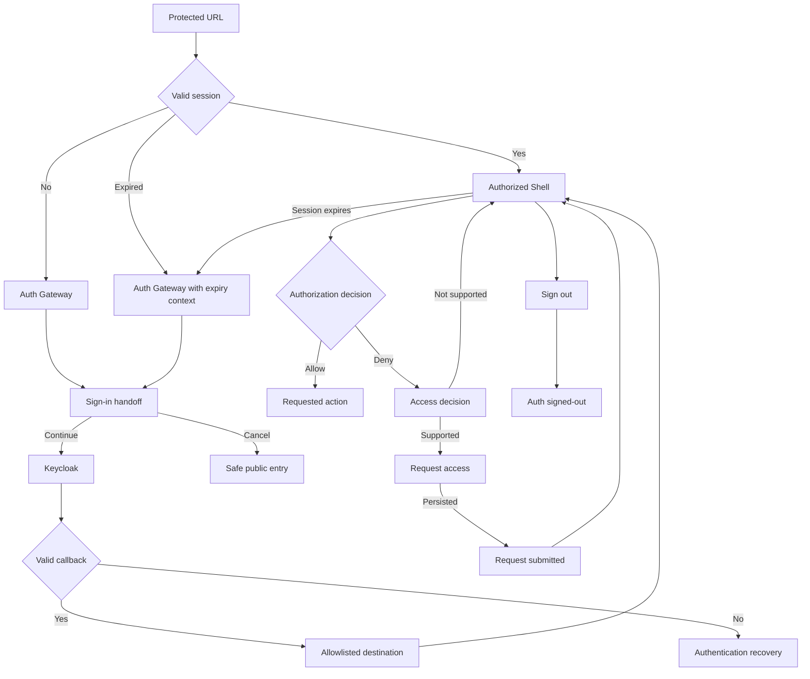

# LinerCore Auth and Shell Inception Design

Status: Approved
Approved: 2026-07-27
Scope: UI/UX prompts 03 through 09
Design date: 2026-07-27
Implementation status: Design only

## Executive Decisions

This package treats the seven routes as one security journey, with one server-
resolved authentication model and two visual contexts:

1. **Auth boundary:** compact, branded, low-chrome pages for sign-in handoff,
   session inspection, authorization decisions, access requests, and sign-out.
2. **Authenticated workspace:** a role-aware operational Shell with stable
   navigation and no inaccessible module placeholders.

The following decisions are ready for approval:

- Use the current `@erp/ui` light tokens as the visual baseline.
- Keep authentication and authorization language business-facing.
- Show only modules and actions granted by the server-resolved permission set.
- Omit global search, notifications, help, and module shortcuts until each has a
  real destination and data contract.
- Use `Bookings`, `Service Contracts & Rates`, `Reference Data`, and `Equipment
  Journeys` as display labels while preserving existing route and API names.
- Make `/auth/signed-out` the canonical sign-out presentation in the target
  design and retain `/signed-out` as a compatibility adapter.
- Do not ask for sign-out confirmation. Separate the action visually and show
  deterministic progress instead.
- Do not expose access-request UI as production-capable until requests are
  authenticated, validated, persisted, deduplicated, and trackable.

The UI/UX Pro Max search recommended a data-dense dashboard and strong keyboard,
form-label, status-feedback, and contrast behavior. Its marketing-oriented
"Enterprise Gateway", green-dominant palette, and Fira typography suggestions
are rejected because they conflict with the approved LinerCore ERP direction.

## 1. Current-State Audit

### 1.1 Evidence inspected

- Running Nginx demo at `http://127.0.0.1`.
- Keycloak login and real sign-in with `booking.user` and `reference.admin`.
- All seven routes at 390, 768, 1024, and 1440px.
- `apps/auth`, `apps/shell`, `packages/auth`, and `packages/ui`.
- Keycloak realm roles and local seed role mappings.
- Existing unit-test identifiers and route contracts.
- Approved W2-01 refined mockups, interaction specification, and application
  decisions.
- Current DCSA Booking, Track & Trace, Industry Blueprint, Information Model,
  and glossary material.

### 1.2 Cross-cutting findings

| Finding | Evidence | Design response |
| --- | --- | --- |
| Auth child-page links are not edge-aware | `/api/auth/sign-in`, `/api/auth/session`, `/request-access`, and `/sign-in` return HTTP 404 through Nginx | All browser actions use canonical edge paths under `/auth`; route construction is centralized |
| Auth foundations are stronger than page UX | OIDC state, nonce, PKCE, HttpOnly session, server summaries, and same-origin return sanitization already exist | Preserve server contracts and redesign composition/content |
| Safe-return policy is inconsistent | `safeReturnUrl` accepts any same-origin path; Auth Gateway adds a strict module registry; sign-in handoff displays the raw query | Use one strict destination registry for Gateway, handoff, expiry, and signed-out return |
| Auth pages use technical language | BFF, callback, client ID, raw return URL, payload, reason code, and correlation ID appear in primary content | Move safe diagnostics to a collapsed support disclosure |
| Shell is not role-aware | `reference.admin` sees Booking and an `Open Booking` action despite lacking Booking permission | Generate navigation and overview content from server permissions |
| Shell shows inaccessible modules | Reference Data and Charge Agreements are visible as disabled entries | Omit inaccessible and unavailable modules entirely |
| Shell home is a walking skeleton | Session, mounted module, and trace cards dominate the page | Replace with task and exception-oriented operational content |
| Current responsive layout is incomplete | 390px has a 107px top bar and 207px always-open nav; 1024px has 25px horizontal overflow | Use drawer navigation below 1024px and fixed responsive tracks |
| Session route is static and public | It does not load session data or redirect signed-out users | Resolve session server-side and fail closed |
| Session DTO lacks requested facts | `SessionSummary` omits authentication and expiry timestamps and business scope | Extend the safe DTO before showing these values |
| Access-request flow is a stub | It accepts anonymous, empty, tampered requests and returns an ephemeral success object | Treat as unsupported until backend work is complete |
| Sign-out presentation is duplicated | Auth and Shell pages differ in words, typography, and route ownership | Use one state/content contract and one shared presentation |
| Callback errors are misclassified | Invalid callback redirects to a generic "permission denied" page | Map authentication failures to authentication-specific recovery copy |

### 1.3 Route-by-route audit

#### Page 03: `/auth/sign-in`

Preserve:

- `returnUrl` input to the sign-in route.
- OIDC transaction creation with a five-minute transaction cookie.
- State, nonce, PKCE, and server-side callback exchange.
- `data-testid="sign-in-button"`.

Redesign:

- Remove `BFF`, `Keycloak`, callback, client, and raw return URL content.
- Replace `Continue with Keycloak` with `Continue to sign in`.
- Add safe business destination, Cancel, redirect progress, and failure states.
- Correct the browser action to `/auth/api/auth/sign-in`.

Current defect:

- The rendered `/api/auth/sign-in` action returns 404 at the edge.

#### Page 04: `/`

Preserve:

- Server-side `requireShellSession`.
- Real subject propagation and fail-closed protected routes.
- Existing Shell and Booking test identifiers.
- Home and Booking route compatibility.

Redesign:

- Replace `Application shell`, W2-01, mounted-module, and trace content.
- Add skip link, active navigation semantics, environment, breadcrumbs, user
  menu, responsive drawer, and operational overview.
- Remove unauthorized or unavailable module placeholders.
- Move correlation information into support details.

Current defects:

- No skip link or `aria-current`.
- Root content does not vary by role.
- `reference.admin` sees Booking and `Open Booking`.
- Search, notifications, help, and a true user menu do not exist.
- 1024px creates horizontal page overflow.

#### Page 05: `/auth/session`

Preserve:

- Safe server-side session endpoint.
- `session-json-link` and `sign-out-button` test IDs where their controls remain.
- Sign-out POST behavior.

Redesign:

- Resolve the session before render.
- Show safe identity, roles, capability groups, and policy version.
- Make `Return to workspace` primary and Sign out a separated command.
- Restrict safe JSON to local demo administrators.

Current defects:

- Page is visible without authentication.
- It shows no actual session facts.
- JSON is the primary feature.
- `/api/auth/session` and `/api/auth/sign-out` resolve outside `/auth` and fail
  through Nginx.
- Issued time, expiry time, and business scope are absent from the safe DTO.

#### Page 06: `/auth/access-denied`

Preserve:

- Reason, resource, action, and correlation inputs for compatibility.
- `request-access-link`.
- In-Shell `AccessDeniedPanel` for module-level denials.

Redesign:

- Map trusted reason codes to specific business explanations.
- Validate or sign denial context.
- Add Return to workspace and Go back.
- Show Request access only when a real request service supports the capability.
- Collapse technical details.

Current defects:

- Query values are treated as authoritative UI context.
- Callback authentication errors read like missing business permission.
- The Request access link points to `/request-access` and returns 404.
- No duplicate-request or unsupported-request behavior exists.

#### Page 07: `/auth/request-access`

Preserve:

- Current resource/action field names while the contract is migrated.
- `request-access-message` and `request-access-submit` test IDs.

Redesign:

- Require a valid authenticated session and signed, unexpired denial context.
- Show immutable request context and authenticated user.
- Require a business justification.
- Add validation, idempotency, persisted success, and duplicate status.

Current defects:

- Form action points to `/api/auth/request-access` and returns 404 at the edge.
- Direct `/auth/api/auth/request-access` accepts anonymous and empty requests.
- Resource and action can be tampered with.
- There is no persistence, approver, duration policy, duplicate detection,
  tracking route, rejection state, or success page.

#### Page 08: `/auth/signed-out`

Preserve:

- Public availability.
- `signed-out-sign-in-link`.

Redesign:

- Use LinerCore naming consistently.
- Distinguish successful app sign-out, incomplete identity-provider sign-out,
  sign-out failure, and already signed out.
- Route Sign in again through the canonical Auth Gateway.

Current defects:

- It says `Shared Platform`, unlike the Shell.
- `/sign-in` returns 404.
- It is not the current Keycloak post-logout destination.

#### Page 09: `/signed-out`

Preserve:

- Public availability.
- Current Keycloak post-logout compatibility.
- `shell-signed-out-page` and `shell-signed-out-sign-in`.

Redesign:

- Make it a thin adapter to the canonical Auth signed-out experience.
- Preserve signed-out reason and safe destination.
- Use identical content and visual rules.

Current defects:

- It cannot distinguish explicit sign-out, expiry, or invalid session.
- It cannot state a safe destination.
- It uses a different typography and composition from Auth.

### 1.4 Existing test contracts to retain

| Area | Current test IDs |
| --- | --- |
| Auth Gateway | `auth-start-link` |
| Sign-in handoff | `sign-in-button` |
| Session | `session-json-link`, `sign-out-button` |
| Auth denied | `request-access-link` |
| Request access | `request-access-message`, `request-access-submit` |
| Auth signed out | `signed-out-sign-in-link` |
| Shell | `shell-home-link`, `shell-user-menu`, `shell-sign-out-button`, `shell-nav-home`, `shell-nav-booking`, `shell-open-booking` |
| Shell denial | `shell-access-denied`, `shell-request-access`, `shell-denied-home` |
| Shell signed out | `shell-signed-out-page`, `shell-signed-out-sign-in` |

New tests may use new IDs, but existing IDs should move with their semantic
controls rather than being deleted.

## 2. Users, Roles, and Authorization Visibility

### 2.1 Current live role evidence

The local Keycloak realm currently defines:

| Realm role | Live display name | Current permissions |
| --- | --- | --- |
| `booking-desk` | Booking Desk | `booking:read`, `booking:create` |
| `reference-admin` | Reference Data Administrator | `reference-data:read`, `reference-data:create` |

The broader seed catalog also names `customer-service` and `platform-operator`,
but those roles are not currently present in the live Keycloak realm. Pricing,
pricing approval, equipment control, supervisor, auditor, and full platform
administrator roles are target personas, not confirmed live roles.

### 2.2 Visibility rules

1. Home is available to every authenticated user.
2. A module appears only when the safe server summary grants its read or entry
   capability and the route is mounted.
3. A command appears only when the specific capability is granted.
4. A user never receives a disabled module teaser.
5. A deep link may show an access decision after the server denies it.
6. Permission checks occur again on every mutation.
7. Client-side visibility is convenience, not authorization.

### 2.3 Navigation and action matrix

| Permission evidence | Visible navigation | Visible actions |
| --- | --- | --- |
| `booking:read` | Bookings | Open booking, search/filter |
| `booking:create` | Bookings | New booking |
| `booking:validate` | Bookings | Validate references |
| `booking:price` | Bookings | Price booking |
| `booking:confirm` | Bookings | Confirm booking |
| `reference-data:read` | Reference Data | View records |
| `reference-data:create` or `write` | Reference Data | Create or edit according to the exact grant |
| Target `charge-agreement:read` | Service Contracts & Rates | View contracts/rates |
| Target pricing approval grant | Service Contracts & Rates | Approve rate version |
| Target `container-movement:read` | Equipment Journeys | View journeys/events |
| Target identity administration grant | Administration | Role/policy actions specifically granted |

The target permission names in the last four rows require domain and identity
contract confirmation. UI code must not infer them from persona names.

### 2.4 Business scope

No organizational or business-scope claim is present in the current live
Keycloak users or `SessionSummary`. Therefore:

- Do not show a fabricated scope.
- Do not show `Global` or `All trades` by default.
- Add scope only after Identity exposes an authoritative, safe display value.
- Continue enforcing record-level scope on the server even when the Shell does
  not display it.

## 3. DCSA Terminology Review

Sources:

- DCSA Booking standard: https://dcsa.org/standards/booking
- DCSA Booking 2.0 documentation: https://dcsa.org/standards/booking/documentation-booking-2
- DCSA Track & Trace documentation: https://dcsa.org/standards/track-and-trace/standard-documentation-track-and-trace
- DCSA Industry Blueprint: https://dcsa.org/standards/industry-blueprint
- DCSA Shipping Glossary: https://dcsa.org/standards/shipping-glossary

| Proposed UI label | DCSA term | Existing LinerCore name/route | Recommended label | Rationale |
| --- | --- | --- | --- | --- |
| Booking module | Booking | `/booking`, `/bookings` | **Bookings** | DCSA uses Booking for the reservation object/process; plural is suitable for a work queue |
| Booking reference | Carrier Booking Reference or Carrier Booking Request Reference, depending lifecycle | `bookingNumber` | **Booking reference** in queues; use the precise DCSA reference on detailed facts when available | Avoid claiming a lifecycle-specific reference without data evidence |
| Charge Agreements | Service contract and rate agreement appear in DCSA terminology | `/charge-agreements` | **Service Contracts & Rates** | Clear internal workbench label using recognized commercial concepts |
| Customer agreement | Service contract | `Agreement` domain object | **Service contract** when it meets the DCSA definition; otherwise **Customer agreement** | Requires domain-owner confirmation of contract semantics |
| Container Journeys | Equipment journey | `/container-movement` | **Equipment Journeys** | DCSA Industry Blueprint explicitly uses Equipment journey for pick-up-to-return activities |
| Movement event | Equipment, Transport, or Shipment event | movement-event domain | Use **Equipment event**, **Transport event**, or **Shipment event** when event type is known | Generic movement event hides DCSA event semantics |
| Reference data | No single DCSA module term | `/reference-data` | **Reference Data** | Internal governance capability; do not force a DCSA rename |
| Location | Location, UN Location, Facility | UN/LOCODE and reference records | **Location**; use **UN Location** or **Facility** where exact | DCSA distinguishes location levels |
| Container | Equipment | `containerRef`, equipment fields | **Equipment** for cross-type domain views; **Container** when the object is known to be a container | DCSA Equipment is broader and standards-aligned |
| Parties | Party with roles such as Shipper and Consignee | customer/party records | Use the precise party role | Avoid generic `Customer` where Shipper, Consignee, or Booking Party is known |
| Track and trace | Track & Trace | container movement service | **Track & Trace** for the cross-journey capability; **Equipment Journeys** for the internal operational module | Separates standard capability from internal queue organization |
| Draft/Confirmed/etc. | DCSA object-specific states | Booking status enum | Preserve current status until a verified state map exists | Do not relabel internal states as DCSA-conformant without semantic mapping |

Domain-owner decisions:

- Confirm whether the current Agreement aggregate satisfies the DCSA service
  contract definition.
- Confirm whether LinerCore Booking states map directly to DCSA Booking 2.0.4.
- Confirm event classification before replacing generic movement-event labels.

## 4. End-to-End Journey

### 4.1 Journey map

| Step | User goal | System behavior | Exit |
| --- | --- | --- | --- |
| Protected entry | Open a saved work URL | Server validates session before rendering protected data | Active session -> destination; no/expired session -> Auth |
| Auth Gateway | Understand why authentication is needed | Resolves allowlisted destination and session/identity availability | Sign in, continue, or retry |
| Sign-in handoff | Continue to company identity | Creates one OIDC transaction and prevents duplicate activation | Keycloak or safe cancel |
| Keycloak | Authenticate | Performs configured identity flow | Callback |
| Callback | Return securely | Verifies state, nonce, PKCE, token, and transaction expiry | Safe destination or auth failure |
| Shell | Resume work | Shows only authorized modules and actions | Module, account/session, or sign out |
| Session | Inspect account access | Shows safe identity and capability facts | Workspace or sign out |
| Denial | Understand a blocked action | Names action/resource and safe recovery | Back, workspace, or supported request |
| Request access | Submit an auditable justification | Validates signed context and persists idempotently | Request status or workspace |
| Sign out/expiry | Remove protected UI | Clears app session and stops protected requests | Canonical signed-out state |

### 4.2 State-transition diagram



Text fallback:

`Protected URL -> session check -> Auth Gateway when absent/expired -> sign-in
handoff -> Keycloak -> verified callback -> allowlisted destination -> role-aware
Shell -> allow action or explain denial -> optional persisted access request ->
workspace. Sign-out clears session -> canonical Auth signed-out page.`

### 4.3 Canonical state sources

| State | Source of truth | UI rule |
| --- | --- | --- |
| Authentication | Server-decoded HttpOnly session | Never infer from client storage |
| Expiry | Session `expiresAt` checked server-side | Add safe expiry to summary; revalidate on focus |
| Authorization | Identity-service decision and safe permission summary | Hide by permission, enforce again on server |
| Safe return | Central destination registry plus same-origin sanitizer | Store destination in OIDC transaction |
| Denial context | Proposed signed, short-lived context token | Query text alone is not trusted |
| Access request | Proposed persisted request service | No success without durable ID |
| Sign-out reason | Server-generated enum | `explicit`, `expired`, `invalid`, `idp_incomplete` |
| Service availability | Server-side bounded health/dependency result | Show recovery, not implementation details |

### 4.4 Deterministic edge behavior

| Risk | Required behavior |
| --- | --- |
| Duplicate sign-in click | First activation sets pending synchronously; subsequent clicks do nothing |
| Redirect loop | One five-minute transaction; failed callback returns to recovery and never auto-restarts |
| Unsafe return | Replace with `/`; tell user in business language |
| Browser Back after sign-out | Protected responses are `no-store`; server redirects before data renders |
| Multiple tabs | Broadcast only `signed-out` or `session-changed`; each tab revalidates server-side |
| Stale permission | Mutation fails closed; page replaces action area with a decision state |
| Replayed denial | Signed context has nonce, subject, expiry, and one-time request id |
| Duplicate request | Idempotency key returns existing request status |
| Identity outage | Keep page stable; show Retry and safe support path |

## 5. Information Architecture

### 5.1 Auth boundary

```text
Auth Gateway
|- Sign-in handoff
|- Current account and session
|- Authentication recovery / access decision
|- Request access, only when supported
`- Signed-out confirmation
```

Auth pages include:

- LinerCore wordmark.
- Environment indicator.
- One page heading.
- One primary task.
- Optional collapsed Technical details in local demo or authorized support mode.
- Authorized-users footer.

Auth pages do not include:

- Authenticated module navigation.
- Global search.
- Notifications.
- Protected record data.
- Marketing navigation.

### 5.2 Authenticated Shell

```text
Home
Authorized modules
|- Bookings
|- Service Contracts & Rates
|- Reference Data
|- Equipment Journeys
`- Administration

User menu
|- Account and session
`- Sign out
```

Only authorized and mounted modules are rendered. Search, notifications, and
help are omitted until functional.

### 5.3 Breadcrumb rules

- Home: `Home`
- Module: `Home / Bookings`
- Record: `Home / Bookings / <booking reference>`
- Account: `Home / Account and session`
- Never show `/auth`, raw paths, IDs without business labels, or query strings.
- On mobile, retain Home and current page; collapse middle segments into an
  accessible menu only when there are more than three segments.

### 5.4 Destination labels

| Safe path family | Business label |
| --- | --- |
| `/` | LinerCore workspace |
| `/bookings` and approved aliases | Bookings |
| `/reference-data` | Reference Data |
| `/charge-agreements` | Service Contracts & Rates |
| `/container-movement` | Equipment Journeys |

Unknown paths fall back to the workspace. The route registry is server-owned.

## 6. Wireframes

Legend: `[P]` primary action, `[S]` secondary action, `[D]` disclosure, and
`[!]` status or recovery message.

### 6.1 Page 03: Sign-in handoff

Desktop primary:

```text
+ LinerCore ------------------------------------- LOCAL DEMO +
|                                                             |
|                 Secure company access                       |
|                 Continue to sign in                         |
|                 Company authentication opens next.          |
|                 Return to: Bookings                          |
|                 [P Continue to sign in] [S Cancel]           |
|                 [D Technical details]                        |
|                                                             |
+ Authorized users only --------------------------------------+
```

Mobile primary:

```text
+ LinerCore     LOCAL +
| Continue to sign in |
| Company authentication
| opens next.
| Return to: Bookings
| [P Continue to sign in]
| [S Cancel]
| [D Technical details]
+--------------------+
```

Desktop failure, identity unavailable:

```text
+ LinerCore ------------------------------------- LOCAL DEMO +
|                 Sign-in is temporarily unavailable          |
|                 We could not reach company authentication.   |
|                 [P Try again] [S Return to workspace]        |
|                 [D Technical details]                        |
+-------------------------------------------------------------+
```

Mobile failure:

```text
| Sign-in is temporarily
| unavailable
| [!] No credentials were sent.
| [P Try again]
| [S Return to workspace]
| [D Technical details]
```

### 6.2 Page 04: ERP Shell overview

Desktop primary:

```text
+ Skip link --------------------------------------------------+
| LinerCore | Environment | Search* | Alerts* | User menu      |
+-----------+-------------------------------------------------+
| Home      | Home                                            |
| Bookings  | Good morning, Booking Operator                  |
|           | My work                           View Bookings  |
| only      | BK-1006  Manual pricing required   Attention     |
| granted   | BK-1004  Reference validation      Due today     |
| modules   |-------------------------------------------------|
|           | Exceptions                                      |
|           | 1 manual-pricing exception                      |
|           |-------------------------------------------------|
|           | Recently viewed                                 |
|           | Booking BK-1005                                 |
+-----------+-------------------------------------------------+
* Render only when functional.
```

Mobile primary:

```text
| [Menu] LinerCore [User]
| Home
| Good morning, Booking Operator
| My work
| BK-1006 / Manual pricing
| BK-1004 / Validate references
| Exceptions
| 1 manual-pricing exception
| Recently viewed
```

Desktop failure, partial degradation:

```text
| [!] Equipment updates are delayed. Last refreshed 10:42.
| My work             | Available data
| Bookings            | normal
| Pricing             | unavailable [Retry]
| Support details [D]
```

Mobile failure:

```text
| [!] Some work could not load.
| Available: Bookings
| Unavailable: Pricing
| [P Retry unavailable data]
| [D Support details]
```

### 6.3 Page 05: Current session

Desktop primary:

```text
+ LinerCore ------------------------------------- LOCAL DEMO +
| Home / Account and session                                  |
| Account and session                                         |
| Booking Operator                                            |
|-------------------------------------------------------------|
| Username          booking.user                              |
| Roles             Booking Desk                              |
| Access            Bookings: Read, Create                    |
| Last sign-in      27 Jul 2026, 00:09                        |
| Session ends      27 Jul 2026, 01:09                        |
|-------------------------------------------------------------|
| [P Return to workspace]                                     |
| Session command                                             |
| [S Sign out]                                                |
| [D Technical details - authorized local support only]       |
+-------------------------------------------------------------+
```

Mobile primary:

```text
| Account and session
| Booking Operator
| Username
| booking.user
| Roles
| Booking Desk
| Access
| Bookings: Read, Create
| Session ends
| 27 Jul 2026, 01:09
| [P Return to workspace]
| ----------------
| [S Sign out]
```

Desktop failure, expired:

```text
| Session expired
| Your workspace session ended. Sign in to continue.
| Destination: Bookings
| [P Sign in again] [S Cancel]
| No prior identity or capability details remain visible.
```

Mobile failure:

```text
| Session expired
| Protected account details
| are no longer displayed.
| [P Sign in again]
| [S Cancel]
```

### 6.4 Page 06: Access denied

Desktop primary:

```text
+ LinerCore ------------------------------------- LOCAL DEMO +
| Authorization decision                                      |
| You cannot approve this rate version                        |
| Rate approval is not included in your current access.       |
| Protected item: Rate version RV-2026-003                    |
| [P Request access]* [S Go back] [S Return to workspace]     |
| [D Technical details]                                       |
+-------------------------------------------------------------+
* Only when a persistent request service supports this action.
```

Mobile primary:

```text
| You cannot approve this
| rate version
| Protected item
| RV-2026-003
| [P Request access]
| [S Go back]
| Return to workspace
| [D Technical details]
```

Desktop failure, invalid context:

```text
| We could not verify this access decision
| The link may be incomplete or expired.
| [P Return to workspace] [S Go back]
| [D Technical details]
```

Mobile failure:

```text
| Decision link expired
| No protected resource
| details are shown.
| [P Return to workspace]
| [S Go back]
```

### 6.5 Page 07: Request access

Desktop primary:

```text
+ LinerCore ------------------------------------- LOCAL DEMO +
| Request access                                              |
| Requested access                                            |
| Resource          Rate version RV-2026-003                  |
| Capability        Approve rate version                      |
| Requester         Booking Operator                          |
| Responsible team  Commercial Pricing Administration         |
|-------------------------------------------------------------|
| Business justification *                                   |
| [textarea.................................................] |
| 0 / 500 characters                                          |
| [x] I understand approval is subject to company policy.     |
| [P Submit request] [S Cancel]                               |
+-------------------------------------------------------------+
```

Mobile primary:

```text
| Request access
| Rate version RV-2026-003
| Approve rate version
| Booking Operator
| Business justification *
| [textarea]
| 0 / 500
| [x] Policy acknowledgement
| [P Submit request]
| [S Cancel]
```

Desktop failure, request service unavailable:

```text
| Access requests are temporarily unavailable
| Your justification has not been submitted.
| [P Try again] [S Return to access decision]
| Preserve typed justification in this tab.
```

Mobile failure:

```text
| Request not submitted
| Your text is still here.
| [P Try again]
| [S Return to decision]
```

### 6.6 Page 08: Auth signed out

Desktop primary:

```text
+ LinerCore ------------------------------------- LOCAL DEMO +
|                  Signed out                                 |
|                  Your LinerCore session has been cleared.   |
|                  [P Sign in again]                          |
|                  Authorized users only                      |
+-------------------------------------------------------------+
```

Mobile primary:

```text
| LinerCore       LOCAL
| Signed out
| Your LinerCore session
| has been cleared.
| [P Sign in again]
```

Desktop failure, identity sign-out incomplete:

```text
| LinerCore session cleared
| Company single sign-on may still be active in this browser.
| [P Complete company sign-out] [S Sign in again]
| [D Technical details]
```

Mobile failure:

```text
| App session cleared
| Company sign-out may be
| incomplete.
| [P Complete sign-out]
| [S Sign in again]
```

### 6.7 Page 09: Shell signed out

Desktop primary, expired deep link:

```text
+ LinerCore --------------------------------------------------+
| Workspace session ended                                     |
| Sign in again to continue to Bookings.                      |
| [P Sign in again] [S Cancel]                                |
| This route delegates to the canonical Auth experience.      |
+-------------------------------------------------------------+
```

Mobile primary:

```text
| Workspace session ended
| Continue to: Bookings
| [P Sign in again]
| [S Cancel]
```

Desktop failure, Auth unavailable:

```text
| Sign-in is temporarily unavailable
| Your prior workspace data is no longer displayed.
| [P Try again]
| Support details [D]
```

Mobile failure:

```text
| Sign-in unavailable
| No protected data is shown.
| [P Try again]
| [D Support details]
```

## 7. High-Fidelity Specification

### 7.1 Global token decisions

Use existing tokens rather than page-local values:

| Purpose | Token | Current value |
| --- | --- | --- |
| App background | `--erp-color-bg` | `#f4f7fb` |
| Surface | `--erp-color-surface` | `#ffffff` |
| Secondary surface | `--erp-color-surface-2` | `#eef3f9` |
| Border | `--erp-color-border` | `#d7e2ef` |
| Strong border | `--erp-color-border-strong` | `#c2d0e0` |
| Text | `--erp-color-text` | `#102235` |
| Muted text | `--erp-color-text-muted` | `#5a6b7d` |
| Primary | `--erp-color-primary` | `#11427a` |
| Primary hover | `--erp-color-primary-hover` | `#0d3663` |
| Success | `--erp-color-success` / `-bg` | `#136b45` / `#e7f4ee` |
| Warning | `--erp-color-warning` / `-bg` | `#8a5200` / `#fbf0dc` |
| Danger | `--erp-color-danger` / `-bg` | `#b42318` / `#fbe9e7` |
| Information | `--erp-color-info` / `-bg` | `#2a68b0` / `#e7f0fb` |
| Focus | `--erp-focus-ring` | 3px accent ring |
| Radius | `--erp-radius-sm`, `--erp-radius-md` | 6px, 8px |
| Surface shadow | `--erp-shadow-1` | Use only for the compact Auth panel |

Do not use `--erp-radius-lg` on these routes. Do not introduce gradients.

### 7.2 Typography

- Product font token: `--erp-font-sans`.
- Target resolved family: Inter for Phase 1 consistency and offline reliability.
- Body: 14px/1.5.
- Secondary: 13px/1.45.
- Labels: 13px/1.3, weight 600.
- H1 Auth: 24px/1.2.
- H1 Shell: 24px/1.2.
- H2: 18px/1.3.
- Eyebrow: 12px/1.3, weight 700, normal letter spacing.
- Identifiers and timestamps: tabular numerals; monospace only for technical
  identifiers inside Technical details.
- No viewport-scaled font sizes and no negative letter spacing.

The current token begins with IBM Plex Sans. Design-system owners should either
confirm that as an approved installed font or update the global token to Inter.
Pages must not override the token locally.

### 7.3 Layout

| Element | Desktop | Tablet | Mobile |
| --- | --- | --- | --- |
| Top bar | 56px | 56px | 56px |
| Side navigation | 232px persistent at >=1024 | Drawer trigger | Drawer trigger |
| Main padding | 24-32px | 24px | 16px |
| Auth panel | 520px default; 640px for request form | max 640px | width minus 32px |
| Shell content max | 1440px fluid work area | fluid | single column |
| Control height | 40px | 40px | 44px |
| Table row | 44px compact | 44px | summary list, not compressed table |

At exactly 1024px, use the persistent 232px nav only if the main track can
remain `minmax(0, 1fr)` without overflow. Otherwise switch the drawer threshold
to 1100px.

### 7.4 Motion and states

- Color/border transitions: 150ms.
- Drawer: 200ms maximum.
- No scale, bounce, or layout-changing hover.
- Redirect progress does not animate beyond a subtle spinner or progress glyph.
- `prefers-reduced-motion: reduce` removes nonessential transitions and spinner
  rotation while retaining text progress.
- Skeletons preserve final dimensions and never expose protected content shape
  before authentication succeeds.

### 7.5 Page-specific visual exceptions

- Access denied uses amber information styling by default, not a red page.
- Authentication failure uses red only for the specific error message or icon.
- Signed out uses a restrained success indicator, not an illustration.
- Sign out is not a filled danger button on the session page; it is a separated
  secondary command with danger text on hover/focus.
- Shell overview sections are unframed bands divided by borders. Individual work
  items may use rows, not nested cards.

## 8. Content Design

### 8.1 Page 03 content matrix

| State | Heading | Body | Primary | Secondary | Announcement |
| --- | --- | --- | --- | --- | --- |
| Default | Continue to sign in | Company authentication opens next. You will return to {destination}. | Continue to sign in | Cancel | None |
| Redirecting | Opening company sign-in | Keep this window open. | Opening sign-in... | None | Opening company sign-in |
| Unsafe destination | Continue to sign in | We could not use the requested destination. You will return to the LinerCore workspace. | Continue to sign in | Cancel | Destination changed for security |
| Expired transaction | Sign-in request expired | Start again to create a new secure sign-in request. | Start again | Cancel | Sign-in request expired |
| Identity unavailable | Sign-in is temporarily unavailable | We could not reach company authentication. No credentials were sent. | Try again | Return to workspace | Company authentication unavailable |
| Redirect failed | Sign-in did not open | Try again. If the problem continues, contact platform support. | Try again | Cancel | Sign-in did not open |

### 8.2 Page 04 content matrix

| State | Heading/content | Primary recovery |
| --- | --- | --- |
| Full | Good morning, {displayName}; My work; Exceptions; Recently viewed | Queue-specific links |
| First login | Welcome to LinerCore | Open first authorized module |
| No assignments | No assigned work right now | View authorized module queue |
| Partial permissions | Render only authorized sections | None |
| Loading | Loading your workspace | None; skeleton plus status |
| Partial degradation | Some work could not load. Available sections are current as of {time}. | Retry unavailable data |
| Stale | This information may be out of date. Last refreshed {time}. | Refresh |
| Search unavailable | Omit search control | None |

Do not say `Everything looks good` when data is unavailable.

### 8.3 Page 05 content matrix

| State | Heading | Body/action |
| --- | --- | --- |
| Normal | Account and session | Return to workspace; Sign out |
| Expiring soon | Your session ends soon | Save your work. Sign in again when the session ends. |
| Expired | Session expired | Sign in again to continue to {destination}. |
| Permission changed | Your access changed | The module list has been refreshed to match your current access. |
| Identity unavailable | Account details are temporarily unavailable | Return to workspace or Try again |
| Signing out | Signing out | Keep this window open. |
| Sign-out failed | Sign-out did not complete | Retry sign out; do not claim the session is cleared |
| Copy success | Technical details copied | Polite announcement only |

### 8.4 Page 06 content by denial type

| Reason | Heading | Explanation |
| --- | --- | --- |
| Missing permission | You cannot {action label} | This action is not included in your current access. |
| Scope mismatch | This record is outside your assigned scope | Your account is not assigned to the required business scope. |
| Permission changed | Your access changed | This action is no longer available. The record was not changed. |
| Expired session | Session expired | Sign in again to continue. |
| Feature unavailable | This action is temporarily unavailable | The protected service could not complete the authorization check. |
| Existing request | Access request already submitted | Request {id} is {status}. |
| Invalid context | We could not verify this access decision | The link may be incomplete or expired. |
| Invalid callback | Sign-in could not be completed | Start a new secure sign-in request. |

Action labels:

- Primary when supported: `Request access`.
- Otherwise primary: `Return to workspace`.
- Secondary: `Go back`.
- Never use `Try again` for a policy denial.

### 8.5 Page 07 labels and validation

| Element | Final content |
| --- | --- |
| Heading | Request access |
| Context group | Requested access |
| User label | Requester |
| Textarea | Business justification |
| Help | Explain why this access is needed for your work. 30-500 characters. Do not include customer secrets or credentials. |
| Acknowledgment | I understand this request is subject to company policy and approval. |
| Primary | Submit request |
| Secondary | Cancel |
| Success heading | Access request submitted |
| Success body | Request {id} is pending review by {team}. Submission does not grant access. |
| Duplicate heading | Access request already exists |
| Policy rejection | This access cannot be requested through LinerCore. Contact {team}. |
| Service failure | Request not submitted. Your justification is still available in this tab. |

Validation:

- Missing justification: `Enter a business justification.`
- Too short: `Use at least 30 characters so the approver can assess the need.`
- Too long: `Use 500 characters or fewer.`
- Missing acknowledgment: `Confirm the policy acknowledgment before submitting.`
- Invalid context: `Return to the access decision and start a new request.`

### 8.6 Pages 08 and 09 content

| State | Heading | Body | Primary |
| --- | --- | --- | --- |
| Explicit success | Signed out | Your LinerCore session has been cleared. | Sign in again |
| Already signed out | You are already signed out | No LinerCore session is active in this browser. | Sign in |
| Expired Shell session | Workspace session ended | Sign in again to continue to {destination}. | Sign in again |
| Invalid session | Workspace session ended | We could not verify your previous session. No protected data is displayed. | Sign in again |
| IdP incomplete | LinerCore session cleared | Company single sign-on may still be active in this browser. | Complete company sign-out |
| Sign-out failed | Sign-out did not complete | Your session may still be active. Try again before leaving this device. | Retry sign out |
| Auth unavailable | Sign-in is temporarily unavailable | No protected data is displayed. | Try again |

No automatic redirect is used after explicit sign-out. It creates loops and can
immediately reauthenticate through active SSO.

## 9. Interaction and State Matrix

| Event/state | UI behavior | Focus | Announcement |
| --- | --- | --- | --- |
| Route loads | Server resolves session before protected render | H1 after navigation | Document title and H1 identify route |
| Redirect starts | Disable semantic action and prevent duplicates | Remains on action | Opening company sign-in |
| Redirect fails | Restore action | Failure heading or alert | Sign-in did not open |
| Drawer opens | Trap focus in drawer; background inert | First nav link | Navigation opened |
| Drawer closes | Restore trigger focus | Menu trigger | None |
| User menu opens | Show Account and session, Sign out | First item | None |
| Session expires | Remove protected content after server revalidation | Expiry heading | Session expired |
| Permission changes | Remove unavailable actions/navigation | Page heading or status | Your access changed |
| Denial arrives | Keep safe record context only | Denial H1 | Action was not completed |
| Request validation fails | Linked summary plus field errors | Error summary | Correct the highlighted fields |
| Request submits | Lock fields and action | Submit button | Submitting access request |
| Request succeeds | Replace form with receipt | Success H1 | Access request submitted |
| Request service fails | Keep typed justification | Error summary | Request not submitted |
| Copy succeeds | Keep disclosure open | Copy button | Technical details copied |
| Sign out starts | Disable menu and sign-out action | Sign-out command | Signing out |
| Sign out succeeds | Clear protected DOM and caches | Signed-out H1 | Signed out |
| Partial data | Keep successful sections | Banner | Some work could not load |
| Stale data | Show timestamp and Refresh | Banner or refresh | Data may be out of date |

Unsaved request-access behavior:

- Cancel with no edits returns immediately.
- Cancel, Back, or route change after meaningful edits uses one focused
  confirmation dialog.
- Browser refresh relies on native form-resubmission protection and does not
  persist sensitive justification to local storage.

## 10. Component Architecture

### 10.1 Existing `@erp/ui` components to reuse

- `DesignSystemStyles`
- `Stack`
- `Inline`
- `Button`
- `Field`
- `Input`
- `Select`
- `Badge`
- `StatusBadge`
- `Table`
- `EmptyState`
- `Skeleton`
- `StatusStrip`
- `Tabs`
- `Combobox`
- `Dialog`
- `Toasts`

`Card` is used only for a truly framed tool or repeated record, not for every
page section.

### 10.2 Shared components to add or formalize

| Component | Ownership | Purpose |
| --- | --- | --- |
| `ProductWordmark` | `@erp/ui` | LinerCore identity and optional product context |
| `EnvironmentBadge` | `@erp/ui` | Local/UAT/Production with semantic text |
| `AppShell` | `@erp/ui` | Header, role-aware nav slot, main landmark |
| `SideNavigation` | `@erp/ui` | Links supplied after server authorization |
| `MobileNavigationDrawer` | `@erp/ui` client | Accessible responsive navigation |
| `Breadcrumbs` | `@erp/ui` | Semantic linked breadcrumb list |
| `PageHeader` | `@erp/ui` | Compact title, status, and actions |
| `UserMenu` | `@erp/ui` client | Account/session and sign-out commands |
| `DefinitionList` | `@erp/ui` | Stable record/account fact layout |
| `Disclosure` | `@erp/ui` | Technical/support details |
| `AlertBanner` | `@erp/ui` | Degradation, stale, warning, and error states |
| `AuthBoundaryLayout` | Auth composition | Shared Auth header/main/footer |
| `AuthStatePanel` | Auth composition | Compact task or recovery surface |
| `DestinationSummary` | Auth composition | Business-safe destination |
| `RedirectAction` | Auth client island | Duplicate-safe redirect progress |
| `AuthorizationDecision` | Shared composition | Business denial content and recovery |
| `AccessRequestForm` | Auth client island | Validation and submission feedback |
| `SignedOutState` | Shared composition | Identical Auth/Shell sign-out presentation |
| `OperationalWorkList` | Shell composition | Dense assigned-work rows |
| `SupportDetails` | Shared composition | Safe correlation/service information |

### 10.3 Route-specific compositions

| Route | Route-specific composition |
| --- | --- |
| `/auth/sign-in` | `SignInHandoff` |
| `/` | `ShellOverview` and server overview assembler |
| `/auth/session` | `AccountSessionFacts` |
| `/auth/access-denied` | Reason-code mapper and denial-context resolver |
| `/auth/request-access` | Request context resolver and receipt |
| `/auth/signed-out` | Sign-out state resolver |
| `/signed-out` | Compatibility adapter only |

### 10.4 Server/client boundary

Server Components:

- Session resolution.
- Permission-to-navigation mapping.
- Destination resolution.
- Denial-context verification.
- Initial account/session facts.
- Shell overview aggregation.
- Service availability.

Client islands:

- Redirect progress.
- User menu.
- Mobile navigation drawer.
- Access-request form.
- Copy feedback.
- Expiry countdown warning after receiving a safe expiry timestamp.

Do not share:

- OIDC transaction and Keycloak redirect construction.
- Authorization decision execution.
- Access-request persistence.
- Cookie clearing or sign-out orchestration.
- Domain data aggregation logic.

These belong to server packages/services, not visual components.

## 11. Responsive Specification

### 11.1 Global breakpoint behavior

| Width | Auth pages | Shell |
| --- | --- | --- |
| 390px | 16px outer padding; one-column panel; full-width actions; 44px controls | 56px top bar, nav drawer, one-column work rows, no fixed sidebar |
| 768px | centered panel up to 640px; actions may remain stacked | top bar plus drawer; two-column facts only when labels remain readable |
| 1024px | centered panel; inline actions | persistent nav only if no overflow; otherwise drawer |
| 1440px | centered compact panel; no oversized whitespace treatment | 232px persistent nav and fluid operational work area |

### 11.2 Route-specific behavior

| Route | 390px | 768px | 1024px | 1440px |
| --- | --- | --- | --- | --- |
| Sign-in handoff | Actions stack; destination wraps | 520px panel | Same | Same |
| Shell overview | Drawer; work rows stack metadata | Drawer; sections may use two columns | Nav based on fit test | Persistent nav; 2-column work layout |
| Session | Definition terms above values | Two-column definition list | Same | Same |
| Access denied | Actions stack; details wrap | Inline secondary actions | Same | Same |
| Request access | One column; software keyboard safe | 640px form | Same | Same |
| Auth signed out | One-column compact state | 520px panel | Same | Same |
| Shell signed out | Delegate before layout render | Same | Same | Same |

Long content rules:

- Resource labels and role names wrap at words.
- Identifiers use `overflow-wrap:anywhere` only in Technical details.
- Buttons wrap labels to two lines only when absolutely necessary; otherwise
  become full width.
- No critical text uses ellipsis.
- Drawers use `100dvh` with safe-area padding.
- Request form scrolls the first invalid control above the software keyboard.

## 12. Accessibility Acceptance Criteria

### 12.1 Structure and navigation

- One visible H1 per route.
- Correct `header`, `nav`, `main`, and `footer` landmarks.
- Shell skip link is the first focusable control.
- `aria-current="page"` identifies active navigation.
- Breadcrumbs use an ordered list inside `nav aria-label="Breadcrumb"`.
- Route changes update document title and move focus to the H1 when the user
  initiated navigation.

### 12.2 Keyboard

- Every action is reachable in logical visual order.
- User menu supports Enter/Space, Escape, and focus restoration.
- Drawer traps focus while open and restores the trigger.
- Disclosures use native `details/summary` unless a custom pattern is required.
- Dialogs are reserved for unsaved changes and restore focus.
- No positive `tabIndex`.

### 12.3 Forms and feedback

- Every control has a persistent label.
- Business justification uses `aria-describedby` for help/count and
  `aria-invalid` when invalid.
- Error summary links to the exact field.
- Submission state is announced and duplicate submission is prevented.
- Success replaces the form only after durable server acceptance.
- Password managers and credentials never interact with request-access fields.

### 12.4 Visual and sensory

- Normal text contrast is at least 4.5:1.
- Focus remains visible at 200% and is not obscured by sticky regions.
- Status uses text plus icon/shape and color.
- At 320 CSS pixels and 400% zoom, content reflows without two-dimensional
  scrolling.
- Touch targets are at least 44px on mobile.
- Reduced motion is honored.
- No information relies on hover.

### 12.5 Async announcements

Use a polite live region for:

- Redirect progress.
- Data refresh and partial degradation.
- Permission changes.
- Copy feedback.
- Request submission and success.
- Sign-out progress.

Use an assertive alert only for:

- Form submission errors.
- Session expiry while the user is actively editing.
- A failed sign-out that may leave the session active.

## 13. Playwright and Visual-Regression Plan

### 13.1 Complete authenticated journey

1. Open `/bookings/<known-id>` without a session.
2. Assert no protected record text is present before redirect.
3. Assert Auth Gateway says `Continue to Bookings`.
4. Continue through handoff and Keycloak.
5. Sign in as `booking.user`.
6. Assert callback returns to the allowlisted booking route.
7. Assert Shell navigation contains Home and Bookings only for the live role.
8. Open Account and session.
9. Assert safe role/capability data and no raw token/cookie.
10. Return to workspace.

### 13.2 Explicit sign-out

1. Open user menu by keyboard.
2. Activate Sign out.
3. Assert progress prevents duplicate submission.
4. Assert canonical Auth signed-out heading receives focus.
5. Assert protected data and navigation are absent.
6. Use browser Back and directly revisit a protected URL.
7. Assert sign-in flow resumes without stale content.

### 13.3 Expiry deep-link journey

1. Seed an expired session with a known `/bookings/<id>` return.
2. Open the protected route.
3. Assert `Workspace session ended` and `Continue to Bookings`.
4. Sign in again.
5. Assert one return to the destination and no redirect loop.

### 13.4 Access-denied and request-access journey

1. Sign in as `reference.admin`.
2. Directly open a protected Booking link.
3. Assert no Booking navigation teaser is present on Home.
4. Assert denial names the protected action/resource without protected data.
5. When request service is disabled, assert Request access is absent.
6. When enabled, open Request access with signed context.
7. Assert immutable context cannot be changed in the browser.
8. Validate blank/short/long justification and linked error summary.
9. Submit twice and assert one durable request ID.
10. Assert duplicate view shows existing status.

### 13.5 Unsafe return and redirect loops

- External `https://` return.
- Protocol-relative return.
- Encoded external return.
- Unknown same-origin path.
- Auth route as return destination.
- Signed-out route as return destination.
- Replayed callback state.
- Expired OIDC transaction.
- Repeated Sign in again with active SSO.

Every case must fall back to `/` or a registered business destination.

### 13.6 Role-aware navigation

| User | Expected visible modules |
| --- | --- |
| `booking.user` | Home, Bookings |
| `reference.admin` | Home, Reference Data |
| Future pricing user | Home, Service Contracts & Rates |
| Future equipment user | Home, Equipment Journeys |

No denied module appears disabled or locked.

### 13.7 Service recovery

- Identity unavailable on Gateway/handoff.
- Session endpoint unavailable.
- One Shell overview dependency unavailable.
- Request service unavailable before and after typing.
- Keycloak sign-out incomplete.

Assert bounded loading, accurate copy, safe retry, and preserved non-sensitive
input where specified.

### 13.8 Visual snapshots

Capture each principal route at:

- 390x844.
- 768x900.
- 1024x800.
- 1440x900.

Additional snapshots:

- Sign-in handoff identity unavailable.
- Shell partial degradation.
- Session expired.
- Denial invalid context.
- Request form validation and service failure.
- IdP sign-out incomplete.

For every snapshot assert:

- `scrollWidth <= innerWidth`.
- No action/status overlap.
- H1 and primary action visible.
- No clipped long content.
- Auth pages use identical header/footer.
- Signed-out pages contain no protected data.

## 14. Implementation Slices

### Slice 1: Auth boundary and edge correctness

Scope:

- Central edge-path helper.
- Shared `AuthBoundaryLayout`, `AuthStatePanel`, `DestinationSummary`, and
  `SupportDetails`.
- Page 03 handoff.
- Canonical signed-out presentation for Pages 08 and 09.
- Strict destination registry shared with Auth Gateway.
- Correct `/auth/api/...` actions.
- Callback reason mapping.

Gate:

- Existing Auth tests plus new edge-route tests.
- Real Keycloak sign-in/sign-out.
- 390/768/1024/1440 visual checks.
- No production access-request claims.

### Slice 2: Safe account/session and user menu

Dependencies:

- Extend `SessionSummary` with safe `authenticatedAt`, `expiresAt`, and optional
  display scope.
- Define expiring-soon threshold, recommended at 10 minutes.

Scope:

- Page 05.
- User menu.
- Multi-tab sign-out/expiry notification.

Gate:

- No token/cookie exposure.
- Expiry and permission-change tests.

### Slice 3: Authorization decision

Dependencies:

- Signed denial context contract.
- Trusted reason-code catalog.
- Capability check for access requests.

Scope:

- Page 06.
- Shared in-Shell denial composition.
- Authentication callback recovery mapping.

Gate:

- Permission, scope, invalid-context, callback, and service-failure tests.

### Slice 4: Persisted access requests

Dependencies:

- Authenticated API.
- Durable storage.
- Approver/responsible team mapping.
- Idempotency and duplicate query.
- Request status and audit events.
- Policy decision on duration.

Scope:

- Page 07 only after dependencies are live.

Gate:

- Anonymous/tampered/replayed requests rejected.
- One durable request for duplicate submissions.
- Audit and status evidence.

### Slice 5: Role-aware Shell and operational overview

Dependencies:

- Permission-to-module registry.
- Shell overview server assembler.
- Real filtered queue links.
- Recently viewed storage contract, or omit the section.

Scope:

- Page 04.
- Responsive drawer and role-aware navigation.
- My work, exceptions, and degradation behavior.

Gate:

- `booking.user` and `reference.admin` visibility.
- Real count-to-filter links.
- Partial dependency failure.
- No overflow at all target widths.

### Recommended sequence

`Slice 1 -> Slice 2 -> Slice 3 -> Slice 4 -> Slice 5`

Slice 5 can begin after Slice 2's shared Shell/user-menu foundation while Slice
4 waits for backend governance work.

## 15. Decision Register

### 15.1 Ready for approval

| Decision | Recommendation |
| --- | --- |
| Auth visual language | Reuse approved Auth Gateway header, panel, environment, and footer |
| Role visibility | Omit inaccessible and unavailable modules |
| Search/notifications/help | Omit until functional |
| Sign-out confirmation | No confirmation |
| Technical data | Collapsed and restricted; never primary |
| DCSA module labels | Bookings; Service Contracts & Rates; Reference Data; Equipment Journeys |
| Auth pages | No authenticated Shell navigation |
| Error tone | Amber for policy decisions; red only for actual failures |
| Auto redirect after sign-out | Do not auto redirect |

### 15.2 Repository-supported assumptions

- Auth owns OIDC, session, request-access, denial, and sign-out route handlers.
- Shell owns protected workspace composition.
- Sessions are HttpOnly and server-decoded.
- Identity-service authorization is fail-closed.
- Local live roles are `booking-desk` and `reference-admin`.
- Current safe session data includes identity, roles, permissions, policy
  version, and correlation ID.
- Current safe session data does not include authentication time, expiry time,
  or business scope.
- Current access-request endpoint is not a durable approval workflow.

### 15.3 Open questions and recommendations

| Question | Evidence | Recommendation |
| --- | --- | --- |
| What is the canonical signed-out route? | Current Keycloak returns to `/signed-out`; Auth also owns `/auth/signed-out` | Make `/auth/signed-out` canonical; retain `/signed-out` as a thin adapter |
| What is the canonical Booking browser route? | ADR says `/booking`; current Nginx and Gateway use `/bookings`, with `/booking` redirecting | Treat `/bookings` as current edge canonical and retain aliases; resolve ADR drift separately |
| Can the session page show login and expiry times? | Values exist in `AuthSession` but not `SessionSummary` | Add safe timestamps to the summary |
| Can business scope be displayed? | No live claim or summary field | Omit until Identity provides an authoritative display value |
| Is Request access supported? | Endpoint accepts anonymous empty requests and does not persist | Mark unsupported in production until Slice 4 dependencies are complete |
| Should request duration be shown? | No policy/contract | Omit initially; add only with policy-defined options |
| Who approves requests? | No approver mapping | Resolve from capability/resource policy, never a free-text approver |
| Can Shell counts link to queues? | No Shell overview aggregator/filter contract confirmed | Add real server aggregation and filters or omit the count |
| Should Recently viewed appear? | No confirmed persistence | Omit until a privacy-reviewed contract exists |
| Should dark mode be exposed? | Tokens support it, but Phase 1 direction is light and no approved control exists | Do not expose a theme toggle in this slice |
| Are Agreement objects DCSA service contracts? | Semantic match is not proven | Keep route/domain name; use display label only after domain-owner confirmation |

## Approval Checklist

- [ ] Approve the two-context model: Auth boundary plus authenticated Shell.
- [ ] Approve omission of inaccessible and unavailable modules.
- [ ] Approve DCSA-aligned display labels.
- [ ] Approve the canonical Auth signed-out recommendation.
- [ ] Approve no sign-out confirmation and no automatic post-sign-out redirect.
- [ ] Approve treating Request access as unsupported until persistence and policy
      dependencies are complete.
- [ ] Approve extending the safe session DTO with authentication and expiry
      timestamps.
- [ ] Approve Slice 1 as the first implementation slice.

## Recommended First Implementation Slice

Start with **Slice 1: Auth boundary and edge correctness**. It fixes the broken
edge actions, gives Pages 03, 08, and 09 one approved visual and state model,
centralizes safe destinations, and creates the shared Auth composition needed by
Pages 05 through 07 without depending on new business APIs.

No production code, configuration, tests, or design-system files were modified
while producing this design package.
